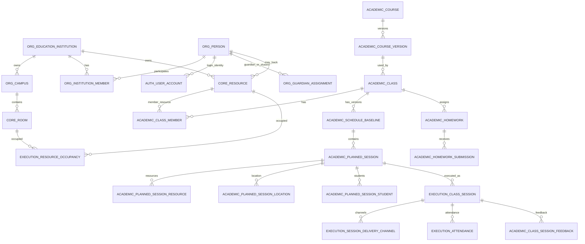

# ClassingSystem Teaching Domain Architecture v1.0 DRAFT

**Document ID**: `ClassingSystem_Teaching_Domain_Architecture_v1.0_DRAFT`  
**Status**: Draft for review  
**Date**: 2026-06-25  
**Baseline**: current runtime DB schema (v2.4 Flyway migrations) + `SessionContextController.buildAvailableWorkspaces()` implementation + v2.4 IA / Role specs + frozen requirements package + role functional specs package  
**Primary purpose**: define the formal teaching-domain architecture for ClassingSystem / Wonders Academy, with manual scheduling as the first-class scheduling path, while remaining aligned with the uploaded v2.4 SQL and frozen IA / permission documents.

---

# 0. Source Baseline and Reading Order

This document is generated from the uploaded baseline files in the current review package. It does not rely on older inaccessible attachments.

| Source file | Size bytes | SHA-256 short |
|---|---:|---|
| `frozen/ADR_025_Password_Flow.md` | 2,194 | `4660bb47e7a49fad` |
| `frozen/ADR_026_Role_Labels.md` | 1,366 | `489f833cff0b4d46` |
| `frozen/ADR_027_Login_Name_Flow.md` | 4,536 | `c624a299e9b78c29` |
| `frozen/CRM_Integration_Architecture_v1.5_Final_Requirements_Frozen.md` | 95,351 | `cab96895d817a7d2` |
| `frozen/ClassingSystem_UI_IA_Spec_v2.4_aligned.md` | 27,259 | `24694c5540d662c6` |
| `frozen/Development_Plan_v3.0.md` | 16,264 | `9594704557e0c2ec` |
| `frozen/Frontend_Architecture_v1.5_Final_Requirements_Frozen.md` | 12,030 | `f14f508adaf3fb55` |
| `frozen/Initial_School_Setup_and_Principal_Administration_Flow_v1.0.md` | 22,489 | `04e5f31a2429a146` |
| `frozen/Wonders_Academy_Role_Permission_Matrix_v1.0.md` | 65,122 | `c9272d78c57e5089` |
| `frozen/Wonders_Website_Architecture_Evolution_v1.5_Final_Requirements_Frozen.md` | 7,761 | `8e017cf64e05a257` |
| `frozen/Workspace_Route_Map_v1.5_Final_Requirements_Frozen.md` | 6,105 | `f976fd5c0f082c04` |
| `migration/V0_0__extensions.sql` | 462 | `4f316811aa1183e3` |
| `migration/V0_1__schemas.sql` | 625 | `cb20520d5020af5d` |
| `migration/V0_2__enums.sql` | 7,989 | `b3764617768ab527` |
| `migration/V2_0__classing_schema_baseline.sql` | 159,892 | `3f53d7b585fb967d` |
| `migration/V2_1__email_schema_and_templates.sql` | 25,320 | `91d2f72250613632` |
| `migration/V2_2__extend_email_and_messaging.sql` | 4,247 | `49c9de2296c5772d` |
| `migration/V2_3__crm_tables.sql` | 12,478 | `46655ab01efa8904` |
| `migration/V2_4__crm_extensions.sql` | 7,159 | `1283ddd3cf0e800a` |
| `roles/00_Master_Index.md` | 6,922 | `1e9edf0d329ae4c9` |
| `roles/01_people_admin.md` | 9,181 | `41dbb8866b3c9de5` |
| `roles/02_operations.md` | 7,266 | `44d618662d02718a` |
| `roles/03_academic_director.md` | 6,743 | `f761c67758d4c526` |
| `roles/04_finance.md` | 2,437 | `f7ad41b1c88521e8` |
| `roles/05_it_admin.md` | 2,873 | `172e7db8be2b0685` |
| `roles/06_sales.md` | 2,871 | `f9677ad5853d2955` |
| `roles/07_marketing.md` | 2,745 | `3a6bdb1a0d6839dc` |
| `roles/08_teacher.md` | 6,563 | `df44417eb0186a54` |
| `roles/09_student.md` | 4,002 | `027c466a78c4efb8` |
| `roles/10_guardian.md` | 4,533 | `ba6791387fa5d9fe` |

## 0.1 Normative priority

When documents overlap or naming differs, implementation should apply this priority:

1. **Current runtime DB schema (v2.4) is the structural source of truth** for implemented schemas, tables, columns, enum values, constraints, functions, triggers, and indexes. SQL migration files are the historical record that produced the current schema.
2. **`ClassingSystem_UI_IA_Spec_v2.4_aligned.md`** is the primary IA / workspace source for route grouping, workspace boundaries, and UI behavior.
3. **`Wonders_Academy_Role_Permission_Matrix_v1.0.md`** is the primary permission source for cross-role access rules.
4. **Role functional specs** define role-specific menus, stories, scopes, and acceptance expectations.
5. **Route map / frontend architecture / CRM architecture** are binding for integration boundaries, unless they conflict with later v2.4-aligned IA or SQL object names.

## 0.2 Naming normalization used in this document

The uploaded documents still contain a few historical route terms:

- Some route maps use `scheduling/attempts`.
- v2.4 SQL uses `execution.scheduling_run`, `execution.scheduling_proposal`, and `execution.scheduling_slot`.
- The role spec for `academic_director` uses “Scheduling Runs”.

For this architecture document, the canonical domain language is:

```text
Scheduling Run      = execution.scheduling_run
Scheduling Proposal = execution.scheduling_proposal
Scheduling Slot     = execution.scheduling_slot
Schedule Baseline   = academic.schedule_baseline
Planned Session     = academic.planned_session
Class Session       = execution.class_session
```

Recommended canonical route names for new implementation:

```text
/app/academic/scheduling/runs
/app/academic/scheduling/proposals
/app/academic/scheduling/confirm
/app/academic/schedule-baselines
/app/academic/planned-sessions
/app/academic/class-sessions
```

If existing frontend code already contains `/app/academic/scheduling/attempts` or `/app/academic/baselines`, treat them as legacy aliases or migration redirects, not as new domain vocabulary.

---

# 1. Scope

## 1.1 In scope

This document covers the formal teaching domain:

- course and course version management;
- teaching material master data where supported by current SQL;
- class creation and class-member management;
- resource model for teachers, students, virtual rooms, and physical rooms;
- time baselines, recurring availability / unavailability patterns, and approved time adjustments;
- manual scheduling as the first-class scheduling process;
- schedule baseline creation, activation, immutability, and versioning;
- planned session generation and immutable schedule facts;
- execution class sessions, delivery channels, hybrid / online / onsite participation, attendance, homework, and feedback;
- resource occupancy facts used to prevent physical time conflicts;
- Academic / Teacher / Student / Guardian workspace boundaries as they relate to teaching-domain data;
- role and permission boundaries for teaching-domain actions.

## 1.2 Explicitly out of scope

The following are not part of the teaching-domain architecture, although they integrate with it:

- CSV import for classes or timetables. The current product decision is manual scheduling only for this phase.
- CRM prospect capture, sales pipeline, marketing activity, sales contracts, payments, churn warnings, renewal reminders.
- Public website implementation.
- SaaSOperator platform application.
- Full automatic scheduling algorithm implementation.
- Platform-level role management beyond its effect on school workspaces.
- Rewriting the uploaded SQL migrations.

## 1.3 Integration boundary

The teaching domain integrates with CRM / Admin only at controlled boundaries:

```text
CRM prospect / trial / sales contract  →  formal student / guardian / contract / class membership
Admin organization / account creation  →  org.person / institution_member / auth.user_account / runtime workspace eligibility
Academic formal teaching               →  class / baseline / planned_session / class_session / attendance
```

Marketing activities are commercial CRM objects. They must not be used to represent formal lessons, class sessions, course delivery, attendance, or makeups.

---

# 2. Core Architectural Decisions

## 2.1 Workspace is not role

The system has five school-facing workspaces:

```text
academic
teacher
student
guardian
admin
```

A workspace is a URL and UI boundary. A role determines available menus, permission tokens, and data scope inside a workspace.

Examples:

- `academic_director` primarily enters the Academic workspace and may have limited Admin read access.
- `teacher` enters the Teacher workspace and sees only own teaching data.
- `student` enters the Student workspace and sees only own data.
- `guardian` enters the Guardian workspace and sees data for linked students through `org.guardian_assignment`.
- `people_admin`, `operations`, `sales`, `marketing`, `finance`, and `it_admin` are Admin workspace roles with menu slicing.

Teacher Portal and Student Portal are not subpages of Academic. They are separate workspaces and do not share the Academic Director dashboard.

## 2.2 Formal teaching domain is separated from CRM

Formal classes, schedule baselines, planned sessions, execution class sessions, attendance, homework, makeups, and teaching review belong to the Academic / Execution domain.

CRM owns prospects, marketing activities, conversion, communication records, sales contracts, payments, renewals, and churn warnings.

A CRM trial or sales event may lead to formal teaching data, but it does not become a formal class session until represented by teaching-domain tables.

## 2.3 Identity is separated from resource

The DDL separates human identity from scheduling resources:

```text
org.person              = legal / contact identity
org.institution_member  = membership in a school institution
core.resource           = schedulable teaching resource: teacher, student, virtual_room
core.room               = physical room resource
```

This separation is critical because time conflict and occupancy logic applies to resources and rooms, not directly to `org.person`.

## 2.4 Time rules support scheduling; they are not the lesson plan

The `time` schema represents availability / unavailability baselines and approved adjustments. It is a scheduling support structure.

It does not replace:

- `academic.schedule_baseline` for confirmed timetable versions;
- `academic.planned_session` for planned lesson facts;
- `execution.class_session` for execution facts.

## 2.5 Schedule baseline is immutable historical truth

A `schedule_baseline` is a confirmed snapshot of a set of planned sessions.

The core rule is:

```text
Do not update or delete an existing baseline.
Create a new baseline version and flip is_current.
```

The SQL enforces this through:

- `UNIQUE (class_id, version_seq)`;
- `uq_schedule_baseline_current` partial unique index;
- `academic.insert_schedule_baseline_safe()`;
- `academic.switch_schedule_baseline()`;
- `academic.guard_schedule_baseline_immutability()` trigger;
- `academic.enforce_single_current_baseline()` trigger.

## 2.6 Planned session is the mainline schedule object

Manual scheduling must write into the same formal structure as automatic scheduling after confirmation:

```text
academic.schedule_baseline
  └── academic.planned_session
        ├── academic.planned_session_resource
        ├── academic.planned_session_location
        └── academic.planned_session_student
```

Manual scheduling does not create a separate CSV-import table, timetable table, or draft schedule table in the canonical DDL.

## 2.7 Class session is execution fact

A `planned_session` says what is planned. A `class_session` says what actually happened or what is being executed.

Execution details belong to:

```text
execution.class_session
execution.session_delivery_channel
execution.session_channel_participant
execution.attendance
academic.class_session_feedback
academic.homework
academic.homework_submission
```

## 2.8 Resource occupancy is the physical conflict ledger

`execution.resource_occupancy` records actual time occupation for resources or rooms.

It supports three source types:

```text
planned_session
class_session
manual_block
```

The exclusion constraint prevents overlapping active time occupation for the same resource or room.

---

# 3. High-Level Domain Model



---

# 4. Workspace Architecture for Teaching Domain

## 4.1 Academic Workspace

Prefix:

```text
/app/academic/*
```

Purpose:

- formal teaching management;
- resource management;
- class structure;
- manual scheduling;
- schedule baseline management;
- class execution;
- attendance and makeups;
- teaching review;
- academic contract visibility;
- time and scheduling settings.

Primary role:

```text
academic_director
```

Read / approval / support roles:

```text
principal
operations
finance (contract/settlement only)
```

Canonical first-level Academic navigation:

```text
Dashboard
我的消息
资源管理
班级管理
手工排课 / 排课管理
课表与执行
教学审核
合同与履约
系统配置
```

The current phase should emphasize **手工排课** over algorithmic proposal workflows. If the UI keeps a broader “排课管理” group, the first exposed action should be manual scheduling.

## 4.2 Teacher Workspace

Prefix:

```text
/app/teacher/*
```

Purpose:

- teacher home / today’s lessons;
- own classes and course records;
- own class attendance;
- homework assignment and review;
- student progress notes;
- messages within allowed scope;
- substitution / termination workflow where configured.

Boundary:

A teacher cannot view all-school students, manage class membership globally, create schedule baselines, manage CRM, manage contracts, create accounts, or assign roles.

## 4.3 Student Workspace

Prefix:

```text
/app/student/*
```

Purpose:

- own class list;
- own schedule and attendance;
- own homework and submissions;
- own messages;
- leave request;
- makeup records;
- termination / resume status if configured.

Boundary:

A student cannot access admin data, other students, teacher workspace, CRM, or school-wide scheduling.

## 4.4 Guardian Workspace

Prefix:

```text
/app/guardian/*
```

Purpose:

- linked children list;
- linked child course data;
- linked child attendance;
- linked child homework;
- linked child messages;
- leave requests for linked children;
- payment / contract summary if configured.

Guardian data scope is resolved by:

```sql
SELECT ga.student_person_id
FROM org.guardian_assignment ga
WHERE ga.guardian_person_id = :currentPersonId
  AND (ga.valid_to IS NULL OR ga.valid_to >= CURRENT_DATE);
```

The Guardian workspace is derived from the guardian_assignment relationship at runtime.

## 4.5 Admin Workspace integration points

Admin is not the teaching execution workspace. It contributes to teaching-domain readiness through:

- organization and account creation;
- role assignment;
- CRM lead conversion;
- email / notification infrastructure;
- finance / payment data;
- IT account support.

Admin roles should not bypass Academic workflow rules for baselines, planned sessions, or attendance.

---

# 5. Teaching-Domain Data Architecture

## 5.1 Organization and membership

Core tables:

```text
org.education_institution
org.campus
org.person
org.institution_member
org.institution_role_assignment
org.campus_role_assignment
org.guardian_assignment
```

Rules:

1. A person may exist before being a teaching resource.
2. A person becomes a school participant through `org.institution_member`.
3. `member_type` expresses structural identity: student, teacher, staff, contractor, guardian.
4. `institution_role_assignment` is only for school-level management roles. It must not encode teaching identity.
5. Guardian identity is a relationship identity through `org.guardian_assignment`, not an institution role.

## 5.2 Account and workspace access

Workspace access is derived at runtime from `org.institution_role_assignment` and `org.institution_member.member_type`,  
via `SessionContextController.buildAvailableWorkspaces()`. No separate `auth.user_workspace_binding` table is required.

Core tables:

```text
auth.user_account
auth.user_password
```

Rules:

1. `auth.user_account` is decoupled from `org.person` but references it.
2. Institution accounts have `account_scope = 'institution'` and must carry `institution_id`.
3. Platform accounts have `account_scope = 'platform'` and must not carry `institution_id`.
4. Workspace access is granted through runtime permission resolution, not through a persisted binding table.
5. Permission is derived from role source, workspace eligibility derived from role + member_type, permission token, and data scope.

## 5.3 Resource and room model

Core tables:

```text
core.resource
core.room
```

Resource types:

```text
teacher
student
virtual_room
```

Room status values:

```text
active
suspended
```

Rules:

1. Teachers and students must be represented as `core.resource` rows before they can be scheduled.
2. Physical classrooms are `core.room` rows.
3. Online meeting rooms or virtual spaces are represented as `core.resource` with `resource_type = 'virtual_room'`.
4. `core.room.building` and `core.room.floor` are the canonical v2.4 field names.
5. `academic.class.preferred_room_id` is only a soft scheduling preference unless the application introduces a separate hard constraint layer.

## 5.4 Time availability model

Core tables:

```text
time.time_baseline
time.time_pattern
time.time_adjustment
```

Enums:

```text
time_pattern_cycle = weekly | monthly
time_availability_type = available | unavailable
time_adjustment_type = one_time_override | temporary_extension | temporary_reduction | swap_time_slot | emergency_closure | exceptional_opening
```

Rules:

1. `time_baseline` defines the date range for availability rules.
2. `time_pattern` defines recurring availability or unavailability windows.
3. `time_adjustment` defines approved exceptions on a date.
4. Time rules are evaluated before creating planned sessions.
5. Time rules do not themselves create lessons.
6. For manual scheduling UI, availability should be displayed as guidance and validation feedback, but the persisted formal schedule is still `schedule_baseline + planned_session`.

## 5.5 Course and teaching structure

Core tables:

```text
academic.course
academic.course_version
academic.teaching_material
academic.teaching_material_version
academic.class
academic.class_member
academic.class_study_plan
academic.study_plan
```

Rules:

1. `academic.course` is the course definition.
2. `academic.course_version` is the versioned teaching commitment / goal.
3. `academic.class` is the teaching delivery container.
4. A class must bind to a course version.
5. `academic.class_member` binds resources to the class as student, teacher, or assistant.
6. `academic.class_study_plan` represents the class-level teaching plan.
7. `academic.study_plan` represents individual student-level plan under a course version and contract.

Important DDL boundary:

The SQL comments mention class-material binding concepts, but the uploaded v2.4 migrations do **not** define a `class_material` or `class_material_version` table. Therefore implementation must not build UI or backend features requiring persistent class-material binding unless a later migration adds that table.

---

# 6. Manual Scheduling Functional Requirements

## 6.1 Product decision

Manual scheduling is the required path for the current implementation phase.

The system should not depend on CSV import. The system should not require automatic scheduling runs or proposals for ordinary class creation and timetable setup.

Manual scheduling means the academic user creates or edits a timetable through the Academic UI, and the system persists the confirmed result into the formal scheduling model.

## 6.2 Manual scheduling user roles

Primary operator:

```text
academic_director
```

Read / approval / support roles:

```text
principal       = read / optional approval depending school policy
operations      = operational support, not final baseline owner
teacher         = no baseline creation; own schedule visibility only
student         = own schedule visibility only
guardian        = linked student schedule visibility only
```

## 6.3 Manual scheduling entry points

Recommended routes:

```text
/app/academic/classes/:classId/baseline
/app/academic/classes/:classId/manual-schedule
/app/academic/schedule-baselines
/app/academic/planned-sessions
```

If frontend route vocabulary must remain close to current IA, the manual scheduler can be a page under:

```text
/app/academic/scheduling/runs
```

but it must not force creation of `execution.scheduling_run` for every manual timetable.

## 6.4 Manual scheduling minimum data input

For each class, the manual scheduling UI must have access to:

- class identity: `academic.class.id`;
- course version: `academic.class.course_version_id`;
- class member resources: `academic.class_member.member_resource_id`;
- teacher resource(s): `member_role = 'teacher'`;
- student resources: `member_role = 'student'`;
- preferred room if configured: `academic.class.preferred_room_id`;
- available rooms: `core.room`;
- resource time baselines and adjustments: `time.*`;
- current occupancy: `execution.resource_occupancy`;
- desired effective date / period;
- one or more recurring or one-off time slots;
- teaching mode: `onsite`, `online`, or `hybrid`.

## 6.5 Manual scheduling output

The persisted output of a confirmed manual schedule is:

```text
1. academic.schedule_baseline
2. academic.planned_session rows under the baseline
3. academic.planned_session_resource rows
4. academic.planned_session_location rows
5. academic.planned_session_student rows
6. execution.resource_occupancy rows for each occupied resource / room
7. system.domain_event for baseline creation / switch, where implemented
```

The output is not:

```text
CSV import record
ad hoc timetable table
CRM marketing_activity
execution.scheduling_run by default
execution.scheduling_proposal by default
execution.scheduling_slot by default
```

## 6.6 Manual schedule validation

Before confirmation, the backend must validate:

1. Class exists and belongs to current institution.
2. Class is in a schedulable lifecycle state, normally `draft` or `active`.
3. Teacher resource belongs to the class or is being assigned within the same transaction.
4. Student resources belong to the class or are being assigned within the same transaction.
5. Physical room is `active` and belongs to the institution / campus.
6. Virtual room resource is `resource_type = 'virtual_room'` when online / hybrid requires it.
7. `planned_range` has upper bound greater than lower bound.
8. `teaching_mode` is one of the v2.4 enum values.
9. Candidate sessions do not overlap existing active `resource_occupancy` for involved resources and rooms.
10. Candidate sessions do not violate approved time baselines / adjustments, unless the user has an override permission and records a reason.
11. Room capacity is sufficient if capacity validation is enabled.
12. Campus transfer constraints are checked if consecutive sessions across campuses exist.

## 6.7 Manual schedule confirmation transaction

Manual schedule confirmation should be one atomic backend transaction.

Recommended transaction shape:

```text
BEGIN

1. Lock class row for scheduling.
2. Validate current class members, resources, rooms, time rules, and occupancy.
3. Create new schedule_baseline using academic.insert_schedule_baseline_safe().
4. Insert all planned_session rows for the new baseline.
5. Insert planned_session_resource rows for teacher / assistant resources.
6. Insert planned_session_student rows for student resources.
7. Insert planned_session_location rows for physical or virtual location.
8. Insert execution.resource_occupancy rows for every occupied teacher, assistant, student, room, and/or virtual room.
9. Record domain_event / audit event for baseline creation and activation.
10. Commit.

ROLLBACK on any validation or exclusion-constraint failure.
```

Important implementation note:

`academic.insert_schedule_baseline_safe()` inserts a new baseline with `is_current = true`. This is acceptable if the full manual confirmation is enclosed in one transaction: if session generation fails, the transaction rolls back and the previous current baseline remains visible.

## 6.8 Manual schedule change

A schedule change must not update existing `planned_session` rows.

The correct pattern is:

```text
Existing current baseline Fv0003
        ↓ user changes timetable
Create new baseline Fv0004
        ↓ generate new planned_session set under Fv0004
Activate Fv0004 / make old baseline non-current
        ↓ UI reads Fv0004 as current
Fv0003 remains historical read-only baseline
```

This applies to:

- changing teacher;
- changing room;
- changing time;
- adding recurring sessions;
- removing future sessions from the effective timetable;
- changing teaching mode;
- adding or removing students in a way that affects planned sessions.

## 6.9 One-off cancellation and makeup

The DDL allows two different patterns.

### Pattern A — structural schedule change

Use when the official timetable changes:

```text
new schedule_baseline + new planned_session set
```

### Pattern B — execution-level exception

Use when a single lesson is cancelled, moved, or made up without changing the official timetable pattern:

```text
execution.class_session
execution.session_delivery_channel
execution.attendance
execution.resource_occupancy with source_type = class_session or manual_block
```

Examples:

- cancelled lesson: create or mark an execution class session with cancelled semantics; attendance can use `cancelled` where relevant;
- makeup as formal scheduled lesson: create a planned session under a new baseline;
- makeup as fact-level ad hoc lesson: create `execution.class_session` with `planned_session_id = NULL` and occupancy source `class_session`;
- non-teaching block: create `execution.resource_occupancy` with `source_type = 'manual_block'`.

---

# 7. Scheduling Data Architecture

## 7.1 Automatic scheduling tables retained but not required for manual path

The uploaded SQL includes:

```text
execution.scheduling_run
execution.scheduling_proposal
execution.scheduling_slot
```

These tables are valid and should remain for a future scheduling engine or a guided proposal workflow.

However, for current manual scheduling:

```text
Manual UI → validation → schedule_baseline → planned_session → occupancy
```

not:

```text
Manual UI → scheduling_run → scheduling_proposal → scheduling_slot → confirm proposal
```

## 7.2 When `execution.scheduling_run` may still be used

`execution.scheduling_run` can be used later if the system needs:

- automated timetable search;
- multiple ranked proposals;
- algorithm scoring;
- reproducible constraint snapshots;
- proposal comparison;
- rollback / audit around search runs.

The enum includes `run_reason = 'manual'`, but in the current manual-only product design this should not be interpreted as a requirement to create scheduling runs for ordinary manual timetable entry.

## 7.3 Baseline versioning

The DDL function `academic.insert_schedule_baseline_safe()` calculates the next `version_seq` per class and inserts the row.

Frontend display should format:

```text
version_seq = 1  → Fv0001
version_seq = 2  → Fv0002
version_seq = 12 → Fv0012
```

`version_seq` is only a monotonic order within a class. It must not carry business meaning.

## 7.4 Current baseline lookup

All current timetable queries must filter through:

```sql
SELECT *
FROM academic.schedule_baseline
WHERE class_id = :classId
  AND is_current = true;
```

Then join:

```text
academic.planned_session
academic.planned_session_resource
academic.planned_session_location
academic.planned_session_student
```

Historical baseline pages must query by explicit `baseline_id` or `version_seq`, not by `is_current`.

## 7.5 Planned session immutability

`academic.planned_session` has a trigger forbidding update and delete. The application must not expose “edit this row” behavior.

UI language should avoid implying direct mutation. Recommended labels:

```text
Create new timetable version
Generate new baseline
Replace future schedule from date
View historical baseline
```

Avoid:

```text
Edit baseline row
Delete planned session
Modify planned session time
```

## 7.6 Planned-session participants and location

A planned session consists of:

```text
academic.planned_session                = time, class, baseline, teaching mode
academic.planned_session_resource       = teacher / assistant resources
academic.planned_session_student        = student resources
academic.planned_session_location       = room or virtual room
```

Rules:

1. Every planned session must have at least one teacher resource.
2. A planned session should include all expected student resources for the class at that point in time.
3. Onsite sessions require `room_id`.
4. Online sessions require `virtual_room_resource_id`.
5. Hybrid sessions may require both a physical room and a virtual room depending on delivery design.
6. The location consistency trigger enforces exactly one of `room_id` or `virtual_room_resource_id` per `planned_session_location` row.

For hybrid sessions, because `planned_session_location` has `UNIQUE(planned_session_id)` (only one location row per session), the planned location must represent the primary delivery mode. Actual hybrid channel split should be represented in `execution.session_delivery_channel` per §9.3.

---

# 8. Resource Occupancy Architecture

## 8.1 Purpose

`execution.resource_occupancy` is the time-conflict ledger for both resources and rooms.

It answers:

```text
Is this teacher/student/virtual room/physical room already occupied during this time range?
```

It does not answer:

```text
What is the official timetable version?
What did the student attend?
What course content was taught?
```

## 8.2 Occupancy source types

```text
planned_session = based on formal schedule plan
class_session   = based on actual execution without planned session, e.g. ad hoc makeup
manual_block    = non-teaching block manually declared by admin / academic user
```

## 8.3 Overlap prevention

The DDL uses an exclusion constraint:

```sql
EXCLUDE USING gist (
  applies_to_type WITH =,
  applies_to_id WITH =,
  occupied_range WITH &&
)
```

Therefore, if the application attempts to insert overlapping occupancy for the same object, PostgreSQL rejects it.

## 8.4 Occupancy creation requirements

For manual scheduling, occupancy creation must be explicit and complete.

Required occupancy rows:

- one row for each teacher resource;
- one row for each assistant resource if assistant is scheduled;
- one row for each student resource if student-level conflict prevention is required;
- one row for the physical room if onsite;
- one row for the virtual room resource if online / hybrid.

If the project chooses not to enforce student-level conflicts for group classes initially, the decision must be documented as a product-level simplification. The DDL supports resource-level conflicts for students because students are `core.resource` rows.

## 8.5 Manual blocks

`manual_block` should be used for:

- teacher unavailable due to external reason;
- student unavailable due to external reason if modeled as a blocking fact;
- room unavailable due to repair or external booking;
- school closure not represented by `time_adjustment`;
- other non-course occupancy.

A manual block must not be represented as a planned session.

---

# 9. Execution Architecture

## 9.1 Planned session to class session

A class session is created when a planned lesson is being prepared for execution, executed, cancelled, or recorded.

Standard relation:

```text
academic.planned_session.id = execution.class_session.planned_session_id
```

Ad hoc / fact-level makeup relation:

```text
execution.class_session.planned_session_id = NULL
```

The DDL explicitly allows `planned_session_id` to be NULL.

## 9.2 Delivery channels

Core tables:

```text
execution.session_delivery_channel
execution.session_channel_participant
```

Channel type enum:

```text
onsite
online
hybrid
```

Important distinction:

- `academic.planned_session.teaching_mode` is the planned teaching mode.
- `execution.session_delivery_channel` declares actual delivery channels for one class session.
- `execution.session_channel_participant` records participant-level channel overrides when not everyone follows the default channel.

## 9.3 Hybrid delivery

For hybrid lessons:

```text
class_session
  ├── session_delivery_channel: onsite, default true, room_id set
  ├── session_delivery_channel: online, default false, virtual_room_resource_id set
  └── session_channel_participant: only for participants not following default
```

If everyone follows the default channel, no participant override row is required.

## 9.4 Attendance

Core table:

```text
execution.attendance
```

Attendance records:

- participant resource;
- attendance status;
- health status if relevant;
- attendance channel type;
- actual start and end time;
- recording person and role;
- recording method;
- reason for admin override.

Rules:

1. One attendance row per participant per class session.
2. Attendance channel must exist in `execution.session_delivery_channel`.
3. Admin override must include a reason.
4. Teachers can manage own-class attendance only.
5. Academic directors can view and manage institution-wide academic attendance.
6. Students and guardians read only scoped attendance.

## 9.5 Homework and feedback

Core tables:

```text
academic.homework
academic.homework_submission
academic.class_session_feedback
```

Rules:

1. Homework is assigned to a class.
2. Homework is assigned by a resource, normally a teacher resource.
3. Submission belongs to a student resource.
4. Feedback links class session, student resource, and teacher resource.
5. Teacher workspace must scope homework and feedback to own classes.
6. Student workspace must scope submissions to self.
7. Guardian workspace must scope submissions and feedback to linked students.

---

# 10. Role and Permission Architecture

## 10.1 Permission formula

Permission must be evaluated as:

```text
workspace_access
+ role source
+ permission token
+ resource scope
+ institution scope
+ object lifecycle state
```

Do not authorize solely by `role_code`.

## 10.2 Academic Director

Role source:

```text
org.institution_role_assignment.role_code = 'academic_director'
```

Scope:

```text
institution-wide
```

Primary workspace:

```text
academic
```

Core capabilities:

- manage course and course versions;
- manage teaching resources and rooms;
- create and manage classes;
- assign teachers and students to classes;
- manage class study plans;
- create manual schedules;
- create new schedule baselines;
- activate / switch current baseline through approved service path;
- view and manage planned sessions through baseline creation, not direct row editing;
- view and manage class sessions;
- manage attendance and makeups;
- review teaching plan / course / material changes;
- configure time rules and scheduling strategy.

## 10.3 Principal

Role source:

```text
org.institution_role_assignment.role_code = 'principal'
```

Teaching-domain positioning:

- school-level oversight;
- read access to Academic dashboard and core teaching status;
- optional approval of schedule confirmation if school policy requires it;
- no daily baseline editing as default operating pattern;
- cannot create second principal;
- can assign school-level `it_admin` per current role decision.

## 10.4 Operations

Teaching-domain positioning:

- operational support across academic execution;
- can view and support resources, execution, makeups, and operational class session tasks where granted;
- not the final owner of baseline creation unless explicitly granted by policy;
- cannot bypass baseline immutability.

## 10.5 Teacher

Scope:

```text
own_classes / own_students limited
```

Teacher can:

- view own class schedule;
- view own students in own classes;
- record or modify own-class attendance where allowed;
- assign and review homework for own classes;
- write course records / teaching notes;
- send messages within allowed own-class scope.

Teacher cannot:

- view all-school students;
- create or activate schedule baselines;
- manage CRM prospects;
- manage contracts;
- create accounts;
- assign roles;
- view sales payments.

## 10.6 Student

Scope:

```text
self
```

Student can:

- view own courses;
- view own schedule;
- view own attendance;
- view and submit own homework;
- read own messages;
- submit leave or termination request if configured.

Student cannot access other students or admin / academic management pages.

## 10.7 Guardian

Scope:

```text
linked_students
```

Guardian can:

- view linked student profile;
- view linked student courses;
- view linked student schedule and attendance;
- view linked student homework;
- read and reply to linked-student messages;
- submit leave request for linked student;
- view payment / contract summary if configured.

Guardian cannot access admin, CRM, teacher workspace, or other students.

## 10.8 IT Admin / People Admin boundary

`people_admin` can manage members, user accounts, and school-level role assignment within its allowed role set, but it does not own teaching schedules.

`it_admin` can support accounts, technical configuration, email infrastructure, and relevant audit/log visibility, but it is not a platform role and does not own teaching schedules.

Both roles must respect Academic-domain data boundaries.

---

# 11. API Architecture

## 11.1 Route groups

Recommended API groups:

```text
/api/session/context
/api/academic/dashboard
/api/academic/resources/students
/api/academic/resources/teachers
/api/academic/resources/rooms
/api/academic/courses
/api/academic/course-versions
/api/academic/classes
/api/academic/classes/{classId}/members
/api/academic/classes/{classId}/study-plan
/api/academic/classes/{classId}/manual-schedule
/api/academic/classes/{classId}/schedule-baselines
/api/academic/schedule-baselines
/api/academic/planned-sessions
/api/academic/class-sessions
/api/academic/execution/today
/api/academic/execution/history
/api/academic/execution/makeups
/api/academic/attendance
/api/academic/homework
/api/teacher/**
/api/student/**
/api/guardian/**
```

## 11.2 Manual scheduling API

Recommended endpoints:

```text
GET  /api/academic/classes/{classId}/manual-schedule/context
POST /api/academic/classes/{classId}/manual-schedule/validate
POST /api/academic/classes/{classId}/manual-schedule/confirm
GET  /api/academic/classes/{classId}/schedule-baselines
GET  /api/academic/classes/{classId}/schedule-baselines/{baselineId}
POST /api/academic/classes/{classId}/schedule-baselines/{baselineId}/activate
```

## 11.3 Manual scheduling context response

The context endpoint should return:

```json
{
  "class": { "id": "...", "class_code": "...", "status": "active" },
  "course_version": { "id": "...", "version_code": "..." },
  "current_baseline": { "id": "...", "version_seq": 3, "display_code": "Fv0003" },
  "members": [
    { "resource_id": "...", "member_role": "teacher", "person_name": "..." },
    { "resource_id": "...", "member_role": "student", "person_name": "..." }
  ],
  "rooms": [
    { "room_id": "...", "room_name": "A-301", "capacity": 12, "status": "active" }
  ],
  "time_rules": {
    "baselines": [],
    "patterns": [],
    "adjustments": []
  },
  "occupancy": []
}
```

## 11.4 Manual scheduling confirmation request

Recommended shape:

```json
{
  "effective_from": "2026-09-01T00:00:00+02:00",
  "reason": "Initial manual timetable for 2026/2027",
  "sessions": [
    {
      "planned_range": "[2026-09-07T15:00:00+02:00,2026-09-07T16:00:00+02:00)",
      "teaching_mode": "onsite",
      "teacher_resource_ids": ["..."],
      "assistant_resource_ids": [],
      "student_resource_ids": ["...", "..."],
      "room_id": "...",
      "virtual_room_resource_id": null
    }
  ]
}
```

## 11.5 Manual scheduling confirmation response

Recommended shape:

```json
{
  "baseline_id": "...",
  "version_seq": 4,
  "display_code": "Fv0004",
  "is_current": true,
  "planned_session_count": 32,
  "occupancy_count": 128,
  "warnings": []
}
```

## 11.6 Session context

All workspace menus must be built from:

```text
GET /api/session/context
```

The session context must include:

- current institution;
- current person;
- account scope;
- available workspaces;
- role codes;
- permission tokens by workspace;
- data scopes;
- last workspace / last view are optional client-side preferences (not persisted auth tables in current DB).

---

# 12. Frontend IA Requirements for Manual Scheduling

## 12.1 Academic class detail page

`/app/academic/classes/:classId` should expose:

- class overview;
- course version;
- class status;
- preferred room;
- teachers;
- students;
- class study plan;
- current baseline summary;
- next planned sessions;
- execution summary;
- actions allowed by permissions.

## 12.2 Class baseline tab

`/app/academic/classes/:classId/baseline` should expose:

- current baseline `FvXXXX`;
- historical baseline list;
- effective date range;
- planned session count;
- last activation event;
- compare baseline action;
- create new manual schedule action;
- activate baseline action where allowed.

## 12.3 Manual schedule editor

The manual schedule editor should provide:

- calendar / grid entry;
- recurring session generator;
- single session entry;
- teacher selector constrained to class members or allowed teacher pool;
- student inclusion list;
- room selector;
- virtual room selector;
- teaching mode selector;
- conflict preview;
- time-rule warning panel;
- occupancy conflict errors;
- baseline effective date;
- confirmation reason.

## 12.4 Conflict display

The UI should distinguish:

```text
Hard error        = cannot confirm; DB or policy violation
Warning           = can confirm only with permission / reason
Information       = useful context, no block
```

Hard errors include:

- overlapping resource occupancy;
- room overlap;
- invalid time range;
- inactive room;
- invalid class membership;
- missing teacher;
- missing required location for teaching mode.

Warnings may include:

- outside usual availability;
- preferred room not used;
- room capacity close to limit;
- campus transfer time tight.

## 12.5 Teacher / student / guardian schedule display

Teacher, student, and guardian schedules must be read-only projections of current planned sessions and execution state.

They must not expose baseline mutation actions.

---

# 13. Backend Service Design

## 13.1 Core services

Recommended services:

```text
AcademicClassService
CourseService
ResourceService
TimeRuleService
ManualSchedulingService
ScheduleBaselineService
PlannedSessionService
ExecutionSessionService
AttendanceService
HomeworkService
TeachingFeedbackService
GuardianScopeService
```

## 13.2 ManualSchedulingService responsibilities

`ManualSchedulingService` owns:

- building schedule context;
- validating draft manual timetable;
- checking availability and occupancy;
- creating new baseline in transaction;
- materializing planned sessions;
- materializing resources, students, and locations;
- materializing occupancy;
- emitting domain events / audit logs;
- returning baseline display summary.

It must not own:

- CRM conversion;
- sales contract creation;
- user account creation;
- platform user management;
- teacher workspace rendering.

## 13.3 Transaction boundaries

The following must be transactional:

- baseline creation + all planned session rows + all occupancy rows;
- class session creation + delivery channels;
- attendance correction with admin override reason;
- role assignment / member_type changes that affect available workspaces;
- prospect conversion to formal student / guardian / account where implemented.

## 13.4 Locking strategy

Manual schedule confirmation should lock:

```text
academic.class row
current academic.schedule_baseline row for class
candidate resource occupancy ranges through exclusion insert behavior
```

The exclusion constraint is the final DB-level conflict guard.

The application should still pre-check conflicts to return readable errors.

## 13.5 Error semantics

Recommended error codes:

```text
CLASS_NOT_FOUND
CLASS_NOT_SCHEDULABLE
BASELINE_CONFLICT
RESOURCE_NOT_CLASS_MEMBER
TEACHER_REQUIRED
ROOM_REQUIRED
VIRTUAL_ROOM_REQUIRED
INVALID_TEACHING_MODE
INVALID_TIME_RANGE
TIME_RULE_VIOLATION
OCCUPANCY_CONFLICT
ROOM_CAPACITY_EXCEEDED
CAMPUS_TRANSFER_CONFLICT
PERMISSION_DENIED
```

---

# 14. Audit and Domain Events

## 14.1 Events to record

Teaching-domain events should include:

```text
course_created
course_version_created
class_created
class_member_added
class_member_removed
schedule_baseline_created
schedule_baseline_switched
manual_schedule_confirmed
planned_session_generated
class_session_created
class_session_cancelled
attendance_recorded
attendance_admin_corrected
homework_assigned
homework_submitted
makeup_created
```

The uploaded DDL includes `system.domain_event` and `system.entity_status_log`. The intended split is:

```text
system.domain_event       = business decision events
system.entity_status_log  = lower-level lifecycle/status changes
```

## 14.2 Sensitive operations

Sensitive operations requiring audit include:

- baseline activation;
- manual override of time conflict;
- attendance admin override;
- class member removal;
- teacher reassignment;
- account creation;
- password reset;
- role assignment;
- contract-affecting academic changes.

---

# 15. Reporting and Read Models

## 15.1 Academic dashboard

The Academic dashboard should aggregate:

- today’s planned sessions;
- sessions needing execution setup;
- attendance not recorded;
- makeups pending approval;
- resource conflicts requiring review;
- upcoming baseline changes;
- active classes count;
- teacher workload;
- room utilization;
- student attendance risk if implemented.

## 15.2 Teacher dashboard

Teacher home should show:

- today’s own lessons;
- upcoming own lessons;
- attendance tasks;
- homework tasks;
- unread messages;
- substitution / cancellation notices.

## 15.3 Student dashboard

Student home should show:

- next class;
- own course list;
- homework due;
- attendance summary;
- messages;
- makeups.

## 15.4 Guardian dashboard

Guardian home should show:

- linked children;
- next classes by child;
- attendance summary;
- homework due;
- school messages;
- leave request entry;
- payment / contract summary if configured.

---

# 16. DDL Alignment Notes and Review Gates

This section records points discovered while aligning the architecture to the uploaded SQL. These are not changes to the SQL; they are review gates for implementation.

## 16.1 `execution.class_session.status` value mismatch

The enum `enum.execution_session_status_enum` contains:

```text
draft, active, suspended, completed, cancelled, expired, archived
```

The function `execution.create_class_session_with_channels()` inserts:

```sql
status = 'scheduled'
```

`scheduled` is not in the enum. Implementation must resolve this before using the function in production.

Acceptable resolutions for review:

1. Add `scheduled` to `enum.execution_session_status_enum`; or
2. Change the function to insert `draft` or `active`, depending on lifecycle semantics.

## 16.2 `planned_session` occupancy trigger cannot see resource rows inserted later

`execution.ensure_occupancy_on_planned_session()` is an `AFTER INSERT ON academic.planned_session` trigger. It inserts occupancy by selecting from `academic.planned_session_resource` for the new planned session.

However, because `planned_session_resource` rows require `planned_session_id`, they are normally inserted **after** `planned_session`. Therefore the trigger may find no resources at the time it runs.

The function `academic.create_planned_session_with_occupancy()` has the same practical issue: its signature inserts only `planned_session`, then tries to create occupancy from already existing child rows.

Manual scheduling implementation should not rely on this trigger/function as the sole mechanism for occupancy creation unless the DDL is revised.

Recommended implementation for current architecture:

```text
ManualSchedulingService inserts planned_session,
then child resource/location/student rows,
then explicit occupancy rows,
all in one transaction.
```

A later migration may replace this with a revised DB function accepting resources and locations as parameters.

## 16.3 `planned_session_location` and hybrid planning

The table-level check enforces exactly one of:

```text
room_id
virtual_room_resource_id
```

per row.

For hybrid planning, since `UNIQUE(planned_session_id)` prevents multiple location rows, the system must store the primary planned location only and represent actual hybrid delivery in `execution.session_delivery_channel`.

The execution model already supports multiple delivery channels per class session.

## 16.4 SQL comment vs actual ID type for `execution.resource_occupancy`

The header comments mention changing high-frequency/log tables to sequential IDs, including `execution.resource_occupancy`. The actual uploaded table definition uses:

```sql
id uuid PRIMARY KEY DEFAULT gen_random_uuid()
```

Implementation must follow the actual DDL, not the older comment.

## 16.5 Class material binding absent from uploaded DDL

SQL comments describe class-material relationships, but no class-material binding table exists in the uploaded migrations. UI / backend work for class-material assignment must be deferred or added through a future migration.

## 16.6 Route vocabulary drift

Frozen route map still includes `scheduling/attempts`; v2.4 IA and SQL are better aligned with `scheduling_run`. New code should use `runs` or provide redirects.

---

# 17. Implementation Roadmap for Teaching Domain

## Phase A — Foundation verification

- Run all migrations in a clean PostgreSQL instance.
- Resolve enum/function mismatch for `class_session.status`.
- Decide occupancy generation strategy for manual scheduling.
- Confirm route naming: `runs` vs `attempts`.
- Confirm hybrid delivery projection policy: `planned_session_location` stores the primary planned location; `execution.session_delivery_channel` stores actual onsite / online channel split.

## Phase B — Academic resource and class foundation

- Implement Academic resource pages.
- Implement course and course version pages.
- Implement class list and class detail.
- Implement class member management.
- Implement class study plan page.

## Phase C — Manual scheduling MVP

- Implement manual schedule context API.
- Implement manual schedule validation API.
- Implement manual schedule confirmation API.
- Generate baseline + planned sessions + occupancy transactionally.
- Implement baseline history page.
- Implement current timetable read model.

## Phase D — Execution MVP

- Implement today’s execution page.
- Create class sessions from planned sessions.
- Configure delivery channels.
- Implement attendance recording.
- Implement execution history.

## Phase E — Teacher / Student / Guardian projections

- Teacher: own schedule, attendance, homework.
- Student: own courses, attendance, homework.
- Guardian: linked student view.
- Messaging and notifications scoped to allowed relationships.

## Phase F — Makeups and exceptions

- Implement execution-level makeups.
- Implement planned makeup via new baseline where required.
- Implement manual blocks.
- Implement cancellation flow.

---

# 18. Acceptance Criteria

## 18.1 Manual scheduling acceptance

A manual scheduling implementation is acceptable when:

1. Academic director can create a class manually without CSV.
2. Academic director can assign teacher and students to the class.
3. Academic director can create a schedule by entering time slots manually.
4. The backend validates conflicts before confirmation.
5. Confirmation creates a new `academic.schedule_baseline`.
6. Confirmation creates immutable `academic.planned_session` rows.
7. Confirmation creates participant and location rows.
8. Confirmation creates complete `execution.resource_occupancy` rows.
9. Current baseline is unique per class.
10. Historical baseline remains readable.
11. Changing timetable creates a new baseline instead of updating old rows.
12. Teacher / student / guardian views are read-only projections.
13. No CRM marketing activity is used as a formal class session.

## 18.2 Permission acceptance

Permission implementation is acceptable when:

1. Workspace route guard runs before page rendering.
2. API permission check runs server-side.
3. Data scope filtering is enforced server-side.
4. Teacher sees only own classes.
5. Student sees only self.
6. Guardian sees only linked students.
7. Academic director sees institution-wide academic domain.
8. Admin roles cannot mutate teaching baseline unless explicitly granted by academic permissions.
9. Cross-institution access is impossible through ID guessing.

## 18.3 DDL acceptance

DDL usage is acceptable when:

1. Migrations run cleanly from `V0_0` through `V2_4`.
2. Enums match functions and inserted status values.
3. Baseline immutability triggers are preserved.
4. Planned session immutability triggers are preserved.
5. Resource occupancy exclusion constraint is preserved.
6. Workspace enum includes `academic`, `teacher`, `student`, `guardian`, `admin`.
7. Institution role enum includes `people_admin` and excludes platform-only roles.
8. Platform role enum includes `saas_operator` and `system_maintainer`.

---

# Appendix A — SQL Schema Inventory

### org
- `org.education_institution` — 21 columns: `id`, `institution_code`, `name`, `legal_name`, `country_code`, `tax_id`, `company_register_no`, `regon`, `established_date`, `description`, `primary_phone`, `secondary_phone`, `wechat_id`, `email`, `email1`, `email2`, `email_enrollment`, `email_recruitment`, `status`, `created_at`, `updated_at`
- `org.campus` — 11 columns: `id`, `institution_id`, `campus_code`, `timezone`, `address_line`, `city`, `postal_code`, `country_code`, `status`, `created_at`, `updated_at`
- `org.person` — 19 columns: `id`, `legal_full_name`, `given_name`, `family_name`, `preferred_name`, `gender`, `date_of_birth`, `nationality`, `religion`, `primary_phone`, `wechat_id`, `email`, `address`, `postal_code`, `country_code`, `id_document_type`, `id_document_number`, `created_at`, `updated_at`
- `org.institution_member` — 11 columns: `id`, `institution_id`, `person_id`, `member_type`, `business_identifier`, `original_school_address`, `status`, `valid_from`, `valid_to`, `created_at`, `updated_at`
- `org.institution_role_assignment` — 5 columns: `institution_id`, `person_id`, `role_code`, `assigned_from`, `assigned_to`
- `org.campus_role_assignment` — 5 columns: `campus_id`, `person_id`, `role_code`, `assigned_from`, `assigned_to`
- `org.guardian_assignment` — 6 columns: `student_person_id`, `guardian_person_id`, `relationship_type`, `is_primary_guardian`, `valid_from`, `valid_to`

### core
- `core.resource` — 8 columns: `id`, `institution_id`, `resource_type`, `person_id`, `timezone`, `status`, `created_at`, `updated_at`
- `core.room` — 11 columns: `id`, `institution_id`, `campus_id`, `building`, `floor`, `room_identifier`, `room_name`, `capacity`, `status`, `created_at`, `updated_at`

### time
- `time.time_baseline` — 6 columns: `id`, `applies_to_type`, `applies_to_id`, `start_date`, `end_date`, `created_at`
- `time.time_pattern` — 8 columns: `id`, `time_baseline_id`, `pattern_cycle`, `day_of_week`, `day_of_month`, `start_time`, `end_time`, `availability_type`
- `time.time_adjustment` — 9 columns: `id`, `time_baseline_id`, `adjustment_date`, `start_time`, `end_time`, `adjustment_type`, `reason`, `approved_by_person_id`, `created_at`

### academic
- `academic.course` — 8 columns: `id`, `institution_id`, `course_code`, `name`, `subject_category`, `status`, `created_at`, `updated_at`
- `academic.course_version` — 12 columns: `id`, `course_id`, `version_code`, `version_name`, `description`, `teaching_mode`, `recommended_total_sessions`, `recommended_total_hours`, `effective_from`, `effective_to`, `created_by_id`, `created_at`
- `academic.teaching_material` — 7 columns: `id`, `institution_id`, `material_code`, `material_name`, `material_type`, `created_by_id`, `created_at`
- `academic.teaching_material_version` — 7 columns: `id`, `material_id`, `version_code`, `version_name`, `description`, `created_by_id`, `created_at`
- `academic.class` — 7 columns: `id`, `institution_id`, `course_version_id`, `class_code`, `preferred_room_id`, `status`, `created_at`
- `academic.class_member` — 7 columns: `id`, `class_id`, `member_resource_id`, `member_role`, `joined_at`, `left_at`, `created_at`
- `academic.schedule_baseline` — 8 columns: `id`, `class_id`, `version_seq`, `effective_from`, `effective_to`, `created_by_event_id`, `is_current`, `created_at`
- `academic.planned_session` — 9 columns: `id`, `class_id`, `schedule_baseline_id`, `planned_range`, `planned_start`, `planned_end`, `teaching_mode`, `source_slot_id`, `created_at`
- `academic.planned_session_resource` — 4 columns: `id`, `planned_session_id`, `resource_id`, `member_role`
- `academic.planned_session_location` — 4 columns: `id`, `planned_session_id`, `room_id`, `virtual_room_resource_id`
- `academic.planned_session_student` — 3 columns: `id`, `planned_session_id`, `student_resource_id`
- `academic.class_study_plan` — 7 columns: `id`, `academic_class_id`, `planned_total_sessions`, `planned_total_hours`, `description`, `status`, `created_at`
- `academic.study_plan` — 10 columns: `id`, `institution_id`, `student_resource_id`, `course_version_id`, `contract_id`, `planned_total_sessions`, `planned_total_hours`, `description`, `status`, `created_at`
- `academic.class_session_feedback` — 7 columns: `id`, `class_session_id`, `student_resource_id`, `teacher_resource_id`, `feedback_text`, `score`, `created_at`
- `academic.homework` — 7 columns: `id`, `academic_class_id`, `assigned_by_resource_id`, `title`, `description`, `due_at`, `created_at`
- `academic.homework_submission` — 9 columns: `id`, `homework_id`, `student_resource_id`, `submission_text`, `submitted_at`, `reviewed_by_resource_id`, `review_comment`, `score`, `created_at`

### execution
- `execution.class_session` — 9 columns: `id`, `class_id`, `planned_session_id`, `actual_range`, `scheduled_start`, `scheduled_end`, `session_type`, `status`, `created_at`
- `execution.campus_transfer_time` — 6 columns: `id`, `from_campus_id`, `to_campus_id`, `general_distance_km`, `min_transfer_time`, `created_at`
- `execution.resource_transfer_capability` — 8 columns: `id`, `resource_id`, `from_campus_id`, `to_campus_id`, `min_transfer_time`, `valid_from`, `valid_to`, `created_at`
- `execution.scheduling_run` — 12 columns: `id`, `institution_id`, `class_id`, `run_reason`, `algorithm_version`, `constraint_snapshot`, `scoring_profile`, `triggered_by_person_id`, `status`, `next_search_cursor`, `created_at`, `confirmed_at`
- `execution.scheduling_proposal` — 8 columns: `id`, `scheduling_run_id`, `proposal_rank`, `total_score`, `structure_hash`, `quality_snapshot`, `is_selected`, `created_at`
- `execution.scheduling_slot` — 9 columns: `id`, `scheduling_proposal_id`, `class_id`, `lesson_index`, `slot_range`, `teaching_mode`, `teacher_resource_id`, `room_id`, `created_at`
- `execution.session_delivery_channel` — 10 columns: `id`, `class_session_id`, `channel_type`, `is_default`, `room_id`, `virtual_room_resource_id`, `online_meeting_provider`, `online_meeting_id`, `online_join_url`, `created_at`
- `execution.session_channel_participant` — 4 columns: `class_session_id`, `participant_resource_id`, `channel_type`, `assigned_at`
- `execution.attendance` — 13 columns: `id`, `class_session_id`, `participant_resource_id`, `attendance_status`, `health_status`, `attendance_channel_type`, `actual_start_time`, `actual_end_time`, `recorded_by_person_id`, `recorded_by_role`, `recording_method`, `record_reason`, `recorded_at`
- `execution.resource_occupancy` — 10 columns: `id`, `applies_to_type`, `applies_to_id`, `occupied_range`, `occupied_start`, `occupied_end`, `source_id`, `source_type`, `is_active`, `created_at`

### contract
- `contract.contract` — 7 columns: `id`, `institution_id`, `contract_code`, `contract_type`, `status`, `signed_date`, `created_at`
- `contract.contract_amendment` — 6 columns: `id`, `contract_id`, `amendment_type`, `effective_from`, `reason`, `created_at`
- `contract.snapshot` — 5 columns: `id`, `amendment_id`, `snapshot_type`, `payload_json`, `created_at`

### auth
- `auth.user_account` — 12 columns: `id`, `institution_id`, `account_scope`, `login_name`, `person_id`, `account_status`, `must_change_password`, `password_status`, `password_reset_token`, `password_reset_expire`, `created_at`, `updated_at`
- `auth.user_password` — 9 columns: `id`, `user_account_id`, `password_hash`, `hash_algorithm`, `is_active`, `set_at`, `expires_at`, `revoked_reason`, `created_at`
- `auth.platform_role_assignment` — 6 columns: `user_account_id`, `role_code`, `assigned_from`, `assigned_to`, `created_at`, `updated_at`

### system
- `system.domain_event` — 9 columns: `id`, `institution_id`, `event_type`, `triggered_by_role`, `event_reason`, `target_type`, `target_id`, `payload_json`, `created_at`
- `system.entity_status_log` — 7 columns: `id`, `entity_type`, `from_status`, `operated_by_person_id`, `operated_by_role`, `reason`, `source`

### messaging
- `messaging.broadcast_message` — 9 columns: `id`, `institution_id`, `title`, `body_text`, `status`, `published_at`, `withdrawn_at`, `created_by_person_id`, `created_at`
- `messaging.broadcast_target` — 5 columns: `id`, `broadcast_message_id`, `target_type`, `target_id`, `created_at`
- `messaging.broadcast_read` — 3 columns: `broadcast_message_id`, `person_id`, `read_at`
- `messaging.notification` — 9 columns: `id`, `title`, `body`, `category`, `priority`, `entity_type`, `entity_id`, `created_by`, `created_at`
- `messaging.notification_recipient` — 6 columns: `id`, `notification_id`, `recipient_id`, `is_read`, `read_at`, `created_at`

### email
- `email.email_template` — 8 columns: `id`, `template_code`, `institution_id`, `template_name`, `subject_zh`, `is_active`, `created_at`, `updated_at`
- `email.email_log` — 20 columns: `id`, `template_code`, `recipient_type`, `recipient_id`, `recipient_email`, `subject`, `body`, `status`, `retry_count`, `max_retries`, `created_at`, `sent_at`, `failed_at`, `last_retry_at`, `error_message`, `sent_by`, `source_system`, `institution_id`, `email_account_id`, `business_type`
- `email.email_rate_limit` — 6 columns: `id`, `recipient_id`, `template_code`, `institution_id`, `last_sent_at`, `send_count`
- `email.email_account` — 12 columns: `id`, `name`, `email`, `smtp_host`, `smtp_port`, `smtp_user`, `smtp_pass_enc`, `smtp_secure`, `is_default`, `is_active`, `created_at`, `updated_at`
- `email.email_delivery` — 10 columns: `id`, `email_log_id`, `recipient_addr`, `recipient_type`, `status`, `opened_at`, `clicked_at`, `error_message`, `sent_at`, `created_at`

### media
- `media.media_object` — 6 columns: `id`, `institution_id`, `media_type`, `storage_path`, `checksum`, `created_at`
- `media.media_link` — 5 columns: `id`, `media_object_id`, `target_id`, `target_type`, `created_at`

### biometric
- `biometric.biometric_profile` — 4 columns: `id`, `person_id`, `biometric_type`, `created_at`

### reward
- `reward.point_account` — 5 columns: `id`, `account_type`, `owner_resource_id`, `current_balance`, `created_at`
- `reward.point_transaction` — 9 columns: `id`, `point_account_id`, `transaction_type`, `reason`, `amount`, `related_object_type`, `related_object_id`, `description`, `created_at`
- `reward.referral` — 7 columns: `id`, `referrer_resource_id`, `target_type`, `target_person_id`, `target_room_id`, `status`, `created_at`

### crm
- `crm.prospect` — 40 columns: `id`, `institution_id`, `legal_full_name`, `preferred_name`, `guardian_name`, `guardian_gender`, `guardian_date_of_birth`, `guardian_nationality`, `guardian_phone`, `guardian_email`, `guardian_wechat`, `guardian_address`, `guardian_relationship_type`, `date_of_birth`, `nationality`, `religion`, `primary_phone`, `email`, `wechat_id`, `address`, `grade_of_next_academic_year`, `day_school`, `day_school_grade`, `source`, `source_courses`, `source_language`, `source_url`, `source_channel`, `user_agent`, `ip_address`, `notes`, `status`, `assigned_to`, `created_by`, `converted_to_person_id`, `converted_at`, `contacted_at`, `status_updated_at`, `created_at`, `updated_at`
- `crm.prospect_guardian` — 12 columns: `id`, `prospect_id`, `guardian_name`, `guardian_gender`, `guardian_date_of_birth`, `guardian_nationality`, `guardian_phone`, `guardian_email`, `guardian_wechat`, `guardian_address`, `relationship_type`, `created_at`
- `crm.communication` — 11 columns: `id`, `institution_id`, `entity_type`, `entity_id`, `type`, `subject`, `content`, `direction`, `email_log_id`, `created_by`, `created_at`
- `crm.tag` — 6 columns: `id`, `institution_id`, `name`, `color`, `type`, `created_at`
- `crm.tag_assignment` — 6 columns: `id`, `institution_id`, `tag_id`, `entity_type`, `entity_id`, `created_at`
- `crm.conversion_stage` — 7 columns: `id`, `institution_id`, `name`, `display_order`, `color`, `probability`, `created_at`
- `crm.conversion` — 13 columns: `id`, `institution_id`, `entity_type`, `entity_id`, `stage_id`, `amount`, `probability`, `expected_close_date`, `assigned_to`, `notes`, `created_by`, `created_at`, `updated_at`
- `crm.task` — 15 columns: `id`, `institution_id`, `title`, `description`, `due_date`, `priority`, `status`, `related_to_type`, `related_to_id`, `assigned_to`, `reminder_at`, `completed_at`, `created_by`, `created_at`, `updated_at`
- `crm.student_profile` — 18 columns: `id`, `institution_id`, `person_id`, `grade`, `grade_year`, `grade_month`, `day_school`, `day_school_grade`, `day_school_year`, `day_school_month`, `campus`, `taboos`, `source`, `status`, `notes`, `created_by`, `created_at`, `updated_at`
- `crm.marketing_activity` — 13 columns: `id`, `institution_id`, `title`, `description`, `activity_type`, `start_date`, `end_date`, `location`, `max_participants`, `status`, `created_by`, `created_at`, `updated_at`
- `crm.activity_participant` — 9 columns: `id`, `institution_id`, `activity_id`, `entity_type`, `entity_id`, `status`, `check_in_at`, `notes`, `created_at`
- `crm.sales_contract` — 15 columns: `id`, `institution_id`, `contract_id`, `prospect_id`, `student_profile_id`, `contract_number`, `total_amount`, `status`, `signed_at`, `valid_from`, `valid_to`, `notes`, `created_by`, `created_at`, `updated_at`
- `crm.sales_payment` — 10 columns: `id`, `institution_id`, `sales_contract_id`, `amount`, `payment_date`, `payment_method`, `transaction_ref`, `notes`, `created_by`, `created_at`
- `crm.renewal_reminder` — 12 columns: `id`, `institution_id`, `student_profile_id`, `sales_contract_id`, `due_date`, `amount`, `status`, `reminded_at`, `resolved_at`, `notes`, `created_at`, `updated_at`
- `crm.churn_warning` — 11 columns: `id`, `institution_id`, `student_profile_id`, `risk_level`, `reason`, `status`, `assigned_to`, `resolved_at`, `resolution_notes`, `created_at`, `updated_at`

### saas
- `saas.principal_candidate` — 3 columns: `id`, `person_id`, `login_name`


---

# Appendix B — Teaching-Relevant Table Details

### org schema
#### `org.education_institution`
| Column | Definition |
|---|---|
| `id` | `uuid PRIMARY KEY DEFAULT gen_random_uuid()` |
| `institution_code` | `text NOT NULL` (system-generated) |
| `name` | `text NOT NULL` |
| `legal_name` | `text NOT NULL` |
| `country_code` | `text NOT NULL` |
| `tax_id` | `text` |
| `company_register_no` | `text` |
| `regon` | `text` |
| `established_date` | `date` |
| `description` | `text` |
| `primary_phone` | `text NOT NULL` |
| `secondary_phone` | `text` |
| `wechat_id` | `text` |
| `email` | `text` |
| `email_enrollment` | `text` |
| `email_recruitment` | `text` |
| `email1` | `text` |
| `email2` | `text` |
| `status` | `enum.contract_status_enum NOT NULL` |
| `created_at` | `timestamptz NOT NULL DEFAULT now()` |
| `updated_at` | `timestamptz NOT NULL DEFAULT now()` |

Constraints / invariants: `institution_code` immutable after insert (trigger-enforced); `UNIQUE(institution_code)`

#### `org.campus`
| Column | Definition |
|---|---|
| `id` | `uuid PRIMARY KEY DEFAULT gen_random_uuid()` |
| `institution_id` | `uuid NOT NULL REFERENCES org.education_institution (id)` |
| `campus_code` | `text NOT NULL` |
| `timezone` | `text NOT NULL` |
| `address_line` | `text NOT NULL` |
| `city` | `text NOT NULL` |
| `postal_code` | `text NOT NULL` |
| `country_code` | `text NOT NULL` |
| `status` | `enum.contract_status_enum NOT NULL` |
| `created_at` | `timestamptz NOT NULL DEFAULT now()` |
| `updated_at` | `timestamptz NOT NULL DEFAULT now()` |

Constraints / invariants: `UNIQUE (institution_id, campus_code, country_code, city, address_line)`

#### `org.person`
| Column | Definition |
|---|---|
| `id` | `uuid PRIMARY KEY DEFAULT gen_random_uuid()` |
| `legal_full_name` | `text NOT NULL` |
| `given_name` | `text` |
| `family_name` | `text` |
| `preferred_name` | `text` |
| `gender` | `enum.org_person_gender_enum NOT NULL` |
| `date_of_birth` | `date NOT NULL` |
| `nationality` | `text NOT NULL` |
| `religion` | `text NOT NULL` |
| `primary_phone` | `text NOT NULL` |
| `wechat_id` | `text` |
| `email` | `text` |
| `address` | `text NOT NULL` |
| `postal_code` | `text NOT NULL` |
| `country_code` | `text NOT NULL` |
| `id_document_type` | `text NOT NULL` |
| `id_document_number` | `text NOT NULL` |
| `created_at` | `timestamptz NOT NULL DEFAULT now()` |
| `updated_at` | `timestamptz NOT NULL DEFAULT now()` |

Constraints / invariants: `UNIQUE (legal_full_name, country_code, id_document_number)`

#### `org.institution_member`
| Column | Definition |
|---|---|
| `id` | `uuid PRIMARY KEY DEFAULT gen_random_uuid()` |
| `institution_id` | `uuid NOT NULL REFERENCES org.education_institution (id)` |
| `person_id` | `uuid NOT NULL REFERENCES org.person (id)` |
| `member_type` | `enum.org_institution_member_type_enum NOT NULL` |
| `business_identifier` | `text NOT NULL` |
| `original_school_address` | `text` |
| `status` | `enum.org_institution_member_status_enum NOT NULL` |
| `valid_from` | `date NOT NULL` |
| `valid_to` | `date` |
| `created_at` | `timestamptz NOT NULL DEFAULT now()` |
| `updated_at` | `timestamptz NOT NULL DEFAULT now()` |

Constraints / invariants: `business_identifier` auto-generated by trigger; `UNIQUE (institution_id, member_type, business_identifier)`; `CHECK (valid_to IS NULL OR valid_to >= valid_from)`; `CHECK ( status <> 'suspended' OR valid_to IS NULL )`

#### `org.institution_role_assignment`
| Column | Definition |
|---|---|
| `institution_id` | `uuid NOT NULL REFERENCES org.education_institution (id)` |
| `person_id` | `uuid NOT NULL REFERENCES org.person (id)` |
| `role_code` | `enum.org_institution_role_enum NOT NULL` |
| `assigned_from` | `date NOT NULL` |
| `assigned_to` | `date` |

Constraints / invariants: `PRIMARY KEY (institution_id, person_id, role_code)`; `CHECK (assigned_to IS NULL OR assigned_to >= assigned_from)`

#### `org.campus_role_assignment`
| Column | Definition |
|---|---|
| `campus_id` | `uuid NOT NULL REFERENCES org.campus (id)` |
| `person_id` | `uuid NOT NULL REFERENCES org.person (id)` |
| `role_code` | `enum.org_campus_role_enum NOT NULL` |
| `assigned_from` | `date NOT NULL` |
| `assigned_to` | `date` |

Constraints / invariants: `PRIMARY KEY (campus_id, person_id, role_code)`; `CHECK (assigned_to IS NULL OR assigned_to >= assigned_from)`

#### `org.guardian_assignment`
| Column | Definition |
|---|---|
| `student_person_id` | `uuid NOT NULL REFERENCES org.person (id)` |
| `guardian_person_id` | `uuid NOT NULL REFERENCES org.person (id)` |
| `relationship_type` | `enum.org_guardian_relationship_enum NOT NULL` |
| `is_primary_guardian` | `boolean NOT NULL DEFAULT false` |
| `valid_from` | `date NOT NULL` |
| `valid_to` | `date` |

Constraints / invariants: `PRIMARY KEY (student_person_id, guardian_person_id)`; `CHECK (valid_to IS NULL OR valid_to >= valid_from)`

### core schema
#### `core.resource`
| Column | Definition |
|---|---|
| `id` | `uuid PRIMARY KEY DEFAULT gen_random_uuid()` |
| `institution_id` | `uuid NOT NULL REFERENCES org.education_institution (id)` |
| `resource_type` | `enum.core_resource_type_enum NOT NULL` |
| `person_id` | `uuid REFERENCES org.person (id)` |
| `timezone` | `text NOT NULL` |
| `status` | `enum.core_status_enum NOT NULL` |
| `created_at` | `timestamptz NOT NULL DEFAULT now()` |
| `updated_at` | `timestamptz NOT NULL DEFAULT now()` |

Constraints / invariants: `CHECK ( (resource_type IN ('teacher', 'student') AND person_id IS NOT NULL) OR (resource_type = 'virtual_room' AND person_id IS NULL) )`

#### `core.room`
| Column | Definition |
|---|---|
| `id` | `uuid PRIMARY KEY DEFAULT gen_random_uuid()` |
| `institution_id` | `uuid NOT NULL REFERENCES org.education_institution (id)` |
| `campus_id` | `uuid NOT NULL REFERENCES org.campus (id)` |
| `building` | `text NOT NULL` |
| `floor` | `text NOT NULL` |
| `room_identifier` | `text NOT NULL` |
| `room_name` | `text` |
| `capacity` | `integer NOT NULL` |
| `status` | `enum.core_room_status_enum NOT NULL` |
| `created_at` | `timestamptz NOT NULL DEFAULT now()` |
| `updated_at` | `timestamptz NOT NULL DEFAULT now()` |

Constraints / invariants: `UNIQUE (campus_id, building, floor, room_identifier)`; `CHECK (capacity > 0)`

### time schema
#### `time.time_baseline`
| Column | Definition |
|---|---|
| `id` | `uuid PRIMARY KEY DEFAULT gen_random_uuid()` |
| `applies_to_type` | `enum.time_applies_to_type_enum NOT NULL` |
| `applies_to_id` | `uuid NOT NULL` |
| `start_date` | `date NOT NULL` |
| `end_date` | `date NOT NULL` |
| `created_at` | `timestamptz NOT NULL DEFAULT now()` |

Constraints / invariants: `CHECK (end_date >= start_date)`; `CONSTRAINT no_overlap_time_baseline EXCLUDE USING gist ( applies_to_type WITH =, applies_to_id WITH =, daterange(start_date, end_date, '[]') WITH && )`

#### `time.time_pattern`
| Column | Definition |
|---|---|
| `id` | `bigint PRIMARY KEY GENERATED ALWAYS AS IDENTITY` |
| `time_baseline_id` | `uuid NOT NULL REFERENCES time.time_baseline (id) ON DELETE CASCADE` |
| `pattern_cycle` | `enum.time_pattern_cycle_enum NOT NULL` |
| `day_of_week` | `integer CHECK (day_of_week BETWEEN 1 AND 7)` |
| `day_of_month` | `integer CHECK (day_of_month BETWEEN 1 AND 31)` |
| `start_time` | `time NOT NULL` |
| `end_time` | `time NOT NULL` |
| `availability_type` | `enum.time_availability_type_enum NOT NULL` |

Constraints / invariants: `CHECK (end_time > start_time)`; `CHECK ((end_time - start_time) >= interval '20 minutes')`; `CHECK ( (pattern_cycle = 'weekly' AND day_of_week IS NOT NULL AND day_of_month IS NULL) OR (pattern_cycle = 'monthly' AND day_of_month IS NOT NULL AND day_of_week IS NULL) )`; `CONSTRAINT no_overlap_time_pattern EXCLUDE USING gist ( time_baseline_id WITH =, pattern_cycle WITH =, day_of_week WITH =, day_of_month WITH =, tsrange( ('1970-01-01'::date + start_time), ('1970-01-01'::date + end_time),`

#### `time.time_adjustment`
| Column | Definition |
|---|---|
| `id` | `bigint PRIMARY KEY GENERATED ALWAYS AS IDENTITY` |
| `time_baseline_id` | `uuid NOT NULL REFERENCES time.time_baseline (id) ON DELETE CASCADE` |
| `adjustment_date` | `date NOT NULL` |
| `start_time` | `time NOT NULL` |
| `end_time` | `time NOT NULL` |
| `adjustment_type` | `enum.time_adjustment_type_enum NOT NULL` |
| `reason` | `text NOT NULL` |
| `approved_by_person_id` | `uuid NOT NULL REFERENCES org.person (id)` |
| `created_at` | `timestamptz NOT NULL DEFAULT now()` |

Constraints / invariants: `CHECK (end_time > start_time)`; `CONSTRAINT no_overlap_time_adjustment EXCLUDE USING gist ( time_baseline_id WITH =, adjustment_date WITH =, tsrange( ('1970-01-01'::date + start_time), ('1970-01-01'::date + end_time), '[)' ) WITH && )`

### academic schema
#### `academic.course`
| Column | Definition |
|---|---|
| `id` | `uuid PRIMARY KEY DEFAULT gen_random_uuid()` |
| `institution_id` | `uuid NOT NULL REFERENCES org.education_institution (id)` |
| `course_code` | `text NOT NULL` |
| `name` | `text NOT NULL` |
| `subject_category` | `text` |
| `status` | `enum.academic_course_status_enum NOT NULL` |
| `created_at` | `timestamptz NOT NULL DEFAULT now()` |
| `updated_at` | `timestamptz NOT NULL DEFAULT now()` |

Constraints / invariants: `UNIQUE (institution_id, course_code)`

#### `academic.course_version`
| Column | Definition |
|---|---|
| `id` | `uuid PRIMARY KEY DEFAULT gen_random_uuid()` |
| `course_id` | `uuid NOT NULL REFERENCES academic.course (id) ON DELETE CASCADE` |
| `version_code` | `text NOT NULL` |
| `version_name` | `text NOT NULL` |
| `description` | `text NOT NULL` |
| `teaching_mode` | `enum.academic_teaching_mode_enum NOT NULL` |
| `recommended_total_sessions` | `integer` |
| `recommended_total_hours` | `numeric` |
| `effective_from` | `date NOT NULL` |
| `effective_to` | `date` |
| `created_by_id` | `uuid NOT NULL REFERENCES org.person (id)` |
| `created_at` | `timestamptz NOT NULL DEFAULT now()` |

Constraints / invariants: `UNIQUE (course_id, version_code)`; `CHECK (effective_to IS NULL OR effective_to >= effective_from)`

#### `academic.teaching_material`
| Column | Definition |
|---|---|
| `id` | `uuid PRIMARY KEY DEFAULT gen_random_uuid()` |
| `institution_id` | `uuid NOT NULL REFERENCES org.education_institution (id)` |
| `material_code` | `text NOT NULL` |
| `material_name` | `text NOT NULL` |
| `material_type` | `enum.academic_material_type_enum NOT NULL` |
| `created_by_id` | `uuid NOT NULL REFERENCES org.person (id)` |
| `created_at` | `timestamptz NOT NULL DEFAULT now()` |

Constraints / invariants: `UNIQUE (institution_id, material_code)`

#### `academic.teaching_material_version`
| Column | Definition |
|---|---|
| `id` | `uuid PRIMARY KEY DEFAULT gen_random_uuid()` |
| `material_id` | `uuid NOT NULL REFERENCES academic.teaching_material (id)` |
| `version_code` | `text NOT NULL` |
| `version_name` | `text NOT NULL` |
| `description` | `text NOT NULL` |
| `created_by_id` | `uuid NOT NULL REFERENCES org.person (id)` |
| `created_at` | `timestamptz NOT NULL DEFAULT now()` |

Constraints / invariants: `UNIQUE (material_id, version_code)`

#### `academic.class`
| Column | Definition |
|---|---|
| `id` | `uuid PRIMARY KEY DEFAULT gen_random_uuid()` |
| `institution_id` | `uuid NOT NULL REFERENCES org.education_institution (id)` |
| `course_version_id` | `uuid NOT NULL REFERENCES academic.course_version (id)` |
| `class_code` | `text NOT NULL` |
| `preferred_room_id` | `uuid REFERENCES core.room (id)` |
| `status` | `enum.academic_class_status_enum NOT NULL` |
| `created_at` | `timestamptz NOT NULL DEFAULT now()` |

Constraints / invariants: `UNIQUE (institution_id, class_code)`

#### `academic.class_member`
| Column | Definition |
|---|---|
| `id` | `uuid PRIMARY KEY DEFAULT gen_random_uuid()` |
| `class_id` | `uuid NOT NULL REFERENCES academic.class (id)` |
| `member_resource_id` | `uuid NOT NULL REFERENCES core.resource (id)` |
| `member_role` | `enum.academic_class_member_role_enum NOT NULL` |
| `joined_at` | `date` |
| `left_at` | `date` |
| `created_at` | `timestamptz NOT NULL DEFAULT now()` |

Constraints / invariants: `UNIQUE (class_id, member_resource_id)`; `CHECK (left_at IS NULL OR left_at >= joined_at)`

#### `academic.schedule_baseline`
| Column | Definition |
|---|---|
| `id` | `uuid PRIMARY KEY DEFAULT gen_random_uuid()` |
| `class_id` | `uuid NOT NULL REFERENCES academic.class (id)` |
| `version_seq` | `integer NOT NULL` |
| `effective_from` | `timestamptz NOT NULL` |
| `effective_to` | `timestamptz` |
| `created_by_event_id` | `uuid` |
| `is_current` | `boolean NOT NULL DEFAULT false` |
| `created_at` | `timestamptz NOT NULL DEFAULT now()` |

Constraints / invariants: `UNIQUE (class_id, version_seq)`

#### `academic.planned_session`
| Column | Definition |
|---|---|
| `id` | `uuid PRIMARY KEY DEFAULT gen_random_uuid()` |
| `class_id` | `uuid NOT NULL REFERENCES academic.class (id)` |
| `schedule_baseline_id` | `uuid NOT NULL REFERENCES academic.schedule_baseline (id) ON DELETE CASCADE` |
| `planned_range` | `tstzrange NOT NULL` |
| `planned_start` | `timestamptz GENERATED ALWAYS AS (lower(planned_range)) STORED` |
| `planned_end` | `timestamptz GENERATED ALWAYS AS (upper(planned_range)) STORED` |
| `teaching_mode` | `enum.academic_teaching_mode_enum NOT NULL` |
| `source_slot_id` | `uuid` |
| `created_at` | `timestamptz NOT NULL DEFAULT now()` |

Constraints / invariants: `CHECK (upper(planned_range) > lower(planned_range))`; `CONSTRAINT no_overlap_planned_session EXCLUDE USING gist ( class_id WITH =, schedule_baseline_id WITH =, planned_range WITH && )`

#### `academic.planned_session_resource`
| Column | Definition |
|---|---|
| `id` | `uuid PRIMARY KEY DEFAULT gen_random_uuid()` |
| `planned_session_id` | `uuid NOT NULL REFERENCES academic.planned_session (id) ON DELETE CASCADE` |
| `resource_id` | `uuid NOT NULL REFERENCES core.resource (id)` |
| `member_role` | `enum.academic_class_member_role_enum NOT NULL` |

Constraints / invariants: `UNIQUE (planned_session_id, resource_id)`

#### `academic.planned_session_location`
| Column | Definition |
|---|---|
| `id` | `uuid PRIMARY KEY DEFAULT gen_random_uuid()` |
| `planned_session_id` | `uuid NOT NULL REFERENCES academic.planned_session (id) ON DELETE CASCADE` |
| `room_id` | `uuid REFERENCES core.room (id)` |
| `virtual_room_resource_id` | `uuid REFERENCES core.resource (id)` |

Constraints / invariants: `CHECK ( (room_id IS NOT NULL AND virtual_room_resource_id IS NULL) OR (room_id IS NULL AND virtual_room_resource_id IS NOT NULL) )`; `UNIQUE (planned_session_id)`

#### `academic.planned_session_student`
| Column | Definition |
|---|---|
| `id` | `uuid PRIMARY KEY DEFAULT gen_random_uuid()` |
| `planned_session_id` | `uuid NOT NULL REFERENCES academic.planned_session (id) ON DELETE CASCADE` |
| `student_resource_id` | `uuid NOT NULL REFERENCES core.resource (id)` |

Constraints / invariants: `UNIQUE (planned_session_id, student_resource_id)`

#### `academic.class_study_plan`
| Column | Definition |
|---|---|
| `id` | `uuid PRIMARY KEY DEFAULT gen_random_uuid()` |
| `academic_class_id` | `uuid NOT NULL REFERENCES academic.class (id) ON DELETE CASCADE` |
| `planned_total_sessions` | `integer NOT NULL` |
| `planned_total_hours` | `numeric(6, 2) NOT NULL` |
| `description` | `text` |
| `status` | `enum.academic_study_plan_status_enum NOT NULL` |
| `created_at` | `timestamptz NOT NULL DEFAULT now()` |

Constraints / invariants: `UNIQUE (academic_class_id)`

#### `academic.study_plan`
| Column | Definition |
|---|---|
| `id` | `uuid PRIMARY KEY DEFAULT gen_random_uuid()` |
| `institution_id` | `uuid NOT NULL REFERENCES org.education_institution (id)` |
| `student_resource_id` | `uuid NOT NULL REFERENCES core.resource (id)` |
| `course_version_id` | `uuid NOT NULL REFERENCES academic.course_version (id)` |
| `contract_id` | `uuid NOT NULL REFERENCES contract.contract (id)` |
| `planned_total_sessions` | `integer NOT NULL` |
| `planned_total_hours` | `numeric(6, 2) NOT NULL` |
| `description` | `text` |
| `status` | `enum.academic_study_plan_status_enum NOT NULL` |
| `created_at` | `timestamptz NOT NULL DEFAULT now()` |

Constraints / invariants: `CHECK (planned_total_sessions > 0)`; `CHECK (planned_total_hours > 0)`

#### `academic.class_session_feedback`
| Column | Definition |
|---|---|
| `id` | `uuid PRIMARY KEY DEFAULT gen_random_uuid()` |
| `class_session_id` | `uuid NOT NULL REFERENCES execution.class_session (id) ON DELETE CASCADE` |
| `student_resource_id` | `uuid NOT NULL REFERENCES core.resource (id)` |
| `teacher_resource_id` | `uuid NOT NULL REFERENCES core.resource (id)` |
| `feedback_text` | `text NOT NULL` |
| `score` | `numeric(4, 2)` |
| `created_at` | `timestamptz NOT NULL DEFAULT now()` |

Constraints / invariants: `UNIQUE (class_session_id, student_resource_id)`

#### `academic.homework`
| Column | Definition |
|---|---|
| `id` | `uuid PRIMARY KEY DEFAULT gen_random_uuid()` |
| `academic_class_id` | `uuid NOT NULL REFERENCES academic.class (id) ON DELETE CASCADE` |
| `assigned_by_resource_id` | `uuid NOT NULL REFERENCES core.resource (id)` |
| `title` | `text NOT NULL` |
| `description` | `text NOT NULL` |
| `due_at` | `timestamptz` |
| `created_at` | `timestamptz NOT NULL DEFAULT now()` |

Constraints / invariants: —

#### `academic.homework_submission`
| Column | Definition |
|---|---|
| `id` | `uuid PRIMARY KEY DEFAULT gen_random_uuid()` |
| `homework_id` | `uuid NOT NULL REFERENCES academic.homework (id) ON DELETE CASCADE` |
| `student_resource_id` | `uuid NOT NULL REFERENCES core.resource (id)` |
| `submission_text` | `text` |
| `submitted_at` | `timestamptz` |
| `reviewed_by_resource_id` | `uuid REFERENCES core.resource (id)` |
| `review_comment` | `text` |
| `score` | `numeric(4, 2)` |
| `created_at` | `timestamptz NOT NULL DEFAULT now()` |

Constraints / invariants: `UNIQUE (homework_id, student_resource_id)`

### execution schema
#### `execution.class_session`
| Column | Definition |
|---|---|
| `id` | `uuid PRIMARY KEY DEFAULT gen_random_uuid()` |
| `class_id` | `uuid NOT NULL REFERENCES academic.class (id)` |
| `planned_session_id` | `uuid -- 允许 NULL（例如补课、临时加课） REFERENCES academic.planned_session (id)` |
| `actual_range` | `tstzrange NOT NULL` |
| `scheduled_start` | `timestamptz GENERATED ALWAYS AS (lower(actual_range)) STORED` |
| `scheduled_end` | `timestamptz GENERATED ALWAYS AS (upper(actual_range)) STORED` |
| `session_type` | `enum.execution_session_type_enum NOT NULL` |
| `status` | `enum.execution_session_status_enum NOT NULL` |
| `created_at` | `timestamptz NOT NULL DEFAULT now()` |

Constraints / invariants: `CHECK (upper(actual_range) > lower(actual_range))`

#### `execution.campus_transfer_time`
| Column | Definition |
|---|---|
| `id` | `uuid PRIMARY KEY DEFAULT gen_random_uuid()` |
| `from_campus_id` | `uuid NOT NULL REFERENCES org.campus (id)` |
| `to_campus_id` | `uuid NOT NULL REFERENCES org.campus (id)` |
| `general_distance_km` | `bigint NOT NULL` |
| `min_transfer_time` | `interval NOT NULL` |
| `created_at` | `timestamptz NOT NULL DEFAULT now()` |

Constraints / invariants: `CHECK (from_campus_id <> to_campus_id)`; `CHECK (min_transfer_time > interval '0 minutes')`; `UNIQUE (from_campus_id, to_campus_id)`

#### `execution.resource_transfer_capability`
| Column | Definition |
|---|---|
| `id` | `uuid PRIMARY KEY DEFAULT gen_random_uuid()` |
| `resource_id` | `uuid NOT NULL REFERENCES core.resource (id)` |
| `from_campus_id` | `uuid NOT NULL REFERENCES org.campus (id)` |
| `to_campus_id` | `uuid NOT NULL REFERENCES org.campus (id)` |
| `min_transfer_time` | `interval NOT NULL` |
| `valid_from` | `date NOT NULL` |
| `valid_to` | `date` |
| `created_at` | `timestamptz NOT NULL DEFAULT now()` |

Constraints / invariants: `CHECK (min_transfer_time > interval '0 minutes')`; `CHECK (from_campus_id <> to_campus_id)`; `CHECK (valid_to IS NULL OR valid_to >= valid_from)`; `UNIQUE (resource_id, from_campus_id, to_campus_id, valid_from)`

#### `execution.scheduling_run`
| Column | Definition |
|---|---|
| `id` | `uuid PRIMARY KEY DEFAULT gen_random_uuid()` |
| `institution_id` | `uuid NOT NULL REFERENCES org.education_institution (id)` |
| `class_id` | `uuid NOT NULL REFERENCES academic.class (id)` |
| `run_reason` | `enum.execution_scheduling_run_reason_enum NOT NULL` |
| `algorithm_version` | `text NOT NULL` |
| `constraint_snapshot` | `jsonb NOT NULL` |
| `scoring_profile` | `jsonb NOT NULL` |
| `triggered_by_person_id` | `uuid REFERENCES org.person (id)` |
| `status` | `enum.execution_scheduling_run_status_enum NOT NULL` |
| `next_search_cursor` | `jsonb` |
| `created_at` | `timestamptz NOT NULL DEFAULT now()` |
| `confirmed_at` | `timestamptz` |

Constraints / invariants: `CHECK ( (status <> 'confirmed') OR confirmed_at IS NOT NULL )`

#### `execution.scheduling_proposal`
| Column | Definition |
|---|---|
| `id` | `uuid PRIMARY KEY DEFAULT gen_random_uuid()` |
| `scheduling_run_id` | `uuid NOT NULL REFERENCES execution.scheduling_run (id) ON DELETE CASCADE` |
| `proposal_rank` | `integer NOT NULL` |
| `total_score` | `numeric(10, 4) NOT NULL` |
| `structure_hash` | `text NOT NULL` |
| `quality_snapshot` | `jsonb` |
| `is_selected` | `boolean NOT NULL DEFAULT false` |
| `created_at` | `timestamptz NOT NULL DEFAULT now()` |

Constraints / invariants: `CONSTRAINT uq_proposal_index UNIQUE (scheduling_run_id, proposal_rank)`; `CONSTRAINT uq_proposal_structure UNIQUE (scheduling_run_id, structure_hash)`

#### `execution.scheduling_slot`
| Column | Definition |
|---|---|
| `id` | `uuid PRIMARY KEY DEFAULT gen_random_uuid()` |
| `scheduling_proposal_id` | `uuid NOT NULL REFERENCES execution.scheduling_proposal (id) ON DELETE CASCADE` |
| `class_id` | `uuid NOT NULL REFERENCES academic.class (id)` |
| `lesson_index` | `integer NOT NULL` |
| `slot_range` | `tstzrange NOT NULL` |
| `teaching_mode` | `enum.academic_teaching_mode_enum NOT NULL` |
| `teacher_resource_id` | `uuid NOT NULL REFERENCES core.resource (id)` |
| `room_id` | `uuid REFERENCES core.room (id)` |
| `created_at` | `timestamptz NOT NULL DEFAULT now()` |

Constraints / invariants: `CHECK (upper(slot_range) > lower(slot_range))`; `UNIQUE (scheduling_proposal_id, lesson_index)`

#### `execution.session_delivery_channel`
| Column | Definition |
|---|---|
| `id` | `uuid PRIMARY KEY DEFAULT gen_random_uuid()` |
| `class_session_id` | `uuid NOT NULL REFERENCES execution.class_session (id) ON DELETE CASCADE` |
| `channel_type` | `enum.execution_channel_type_enum NOT NULL` |
| `is_default` | `boolean NOT NULL DEFAULT false` |
| `room_id` | `uuid REFERENCES core.room (id)` |
| `virtual_room_resource_id` | `uuid REFERENCES core.resource (id)` |
| `online_meeting_provider` | `text` |
| `online_meeting_id` | `text` |
| `online_join_url` | `text` |
| `created_at` | `timestamptz NOT NULL DEFAULT now()` |

Constraints / invariants: `UNIQUE (class_session_id, channel_type)`; `CHECK ( (channel_type = 'onsite' AND room_id IS NOT NULL AND virtual_room_resource_id IS NULL AND online_meeting_provider IS NULL AND online_meeting_id IS NULL AND online_join_url IS NULL) OR (channel_type = 'online' AND`

#### `execution.session_channel_participant`
| Column | Definition |
|---|---|
| `class_session_id` | `uuid NOT NULL REFERENCES execution.class_session (id) ON DELETE CASCADE` |
| `participant_resource_id` | `uuid NOT NULL REFERENCES core.resource (id)` |
| `channel_type` | `enum.execution_channel_type_enum NOT NULL` |
| `assigned_at` | `timestamptz NOT NULL DEFAULT now()` |

Constraints / invariants: `PRIMARY KEY (class_session_id, participant_resource_id)`; `CONSTRAINT fk_participant_channel_exists FOREIGN KEY (class_session_id, channel_type) REFERENCES execution.session_delivery_channel (class_session_id, channel_type) ON DELETE CASCADE`

#### `execution.attendance`
| Column | Definition |
|---|---|
| `id` | `uuid PRIMARY KEY DEFAULT gen_random_uuid()` |
| `class_session_id` | `uuid NOT NULL REFERENCES execution.class_session (id)` |
| `participant_resource_id` | `uuid NOT NULL REFERENCES core.resource (id)` |
| `attendance_status` | `enum.execution_attendance_status_enum NOT NULL` |
| `health_status` | `enum.execution_health_status_enum` |
| `attendance_channel_type` | `enum.execution_channel_type_enum NOT NULL` |
| `actual_start_time` | `timestamptz` |
| `actual_end_time` | `timestamptz` |
| `recorded_by_person_id` | `uuid REFERENCES org.person (id)` |
| `recorded_by_role` | `enum.execution_attendance_recorded_by_role_enum NOT NULL` |
| `recording_method` | `enum.execution_attendance_recording_method_enum NOT NULL` |
| `record_reason` | `text` |
| `recorded_at` | `timestamptz NOT NULL DEFAULT now()` |

Constraints / invariants: `CHECK (actual_end_time IS NULL OR actual_end_time >= actual_start_time)`; `CHECK ( recording_method <> 'admin_override' OR record_reason IS NOT NULL )`; `UNIQUE (class_session_id, participant_resource_id)`; `CONSTRAINT fk_attendance_channel_exists FOREIGN KEY (class_session_id, attendance_channel_type) REFERENCES execution.session_delivery_channel (class_session_id, channel_type)`

#### `execution.resource_occupancy`
| Column | Definition |
|---|---|
| `id` | `uuid PRIMARY KEY DEFAULT gen_random_uuid()` |
| `applies_to_type` | `enum.time_applies_to_type_enum NOT NULL` |
| `applies_to_id` | `uuid NOT NULL` |
| `occupied_range` | `tstzrange NOT NULL` |
| `occupied_start` | `timestamptz GENERATED ALWAYS AS (lower(occupied_range)) STORED` |
| `occupied_end` | `timestamptz GENERATED ALWAYS AS (upper(occupied_range)) STORED` |
| `source_id` | `uuid` |
| `source_type` | `enum.execution_occupancy_source_enum NOT NULL` |
| `is_active` | `boolean NOT NULL DEFAULT true` |
| `created_at` | `timestamptz NOT NULL DEFAULT now()` |

Constraints / invariants: `CHECK (upper(occupied_range) > lower(occupied_range))`; `CONSTRAINT no_overlap_resource_occupancy EXCLUDE USING gist ( applies_to_type WITH =, applies_to_id WITH =, occupied_range WITH && )`

### contract schema
#### `contract.contract`
| Column | Definition |
|---|---|
| `id` | `uuid PRIMARY KEY DEFAULT gen_random_uuid()` |
| `institution_id` | `uuid NOT NULL REFERENCES org.education_institution (id)` |
| `contract_code` | `text NOT NULL` |
| `contract_type` | `enum.contract_type_enum NOT NULL` |
| `status` | `enum.contract_status_enum NOT NULL` |
| `signed_date` | `date` |
| `created_at` | `timestamptz NOT NULL DEFAULT now()` |

Constraints / invariants: `UNIQUE (institution_id, contract_code)`

#### `contract.contract_amendment`
| Column | Definition |
|---|---|
| `id` | `uuid PRIMARY KEY DEFAULT gen_random_uuid()` |
| `contract_id` | `uuid NOT NULL REFERENCES contract.contract (id)` |
| `amendment_type` | `enum.contract_amendment_type_enum NOT NULL` |
| `effective_from` | `date NOT NULL` |
| `reason` | `text NOT NULL` |
| `created_at` | `timestamptz NOT NULL DEFAULT now()` |

#### `contract.snapshot`
| Column | Definition |
|---|---|
| `id` | `uuid PRIMARY KEY DEFAULT gen_random_uuid()` |
| `amendment_id` | `uuid NOT NULL REFERENCES contract.contract_amendment (id)` |
| `snapshot_type` | `text NOT NULL` |
| `payload_json` | `jsonb NOT NULL` |
| `created_at` | `timestamptz NOT NULL DEFAULT now()` |

### auth schema
#### `auth.user_account`
| Column | Definition |
|---|---|
| `id` | `uuid PRIMARY KEY DEFAULT gen_random_uuid()` |
| `institution_id` | `uuid REFERENCES org.education_institution (id)` |
| `account_scope` | `enum.auth_account_scope_enum NOT NULL DEFAULT 'institution'` |
| `login_name` | `text NOT NULL` |
| `person_id` | `uuid NOT NULL REFERENCES org.person (id)` |
| `account_status` | `text NOT NULL` |
| `must_change_password` | `boolean NOT NULL DEFAULT false` |
| `password_status` | `enum.auth_password_status_enum NOT NULL DEFAULT 'active'` |
| `password_reset_token` | `text` |
| `password_reset_expire` | `timestamptz` |
| `created_at` | `timestamptz NOT NULL DEFAULT now()` |
| `updated_at` | `timestamptz NOT NULL DEFAULT now()` |

Constraints / invariants: `CHECK ( (account_scope = 'institution' AND institution_id IS NOT NULL) OR (account_scope = 'platform' AND institution_id IS NULL) )`

#### `auth.user_password`
| Column | Definition |
|---|---|
| `id` | `uuid PRIMARY KEY DEFAULT gen_random_uuid()` |
| `user_account_id` | `uuid NOT NULL REFERENCES auth.user_account (id) ON DELETE CASCADE` |
| `password_hash` | `text NOT NULL` |
| `hash_algorithm` | `text NOT NULL` |
| `is_active` | `boolean NOT NULL DEFAULT true` |
| `set_at` | `timestamptz NOT NULL DEFAULT now()` |
| `expires_at` | `timestamptz` |
| `revoked_reason` | `enum.auth_revoked_reason_enum` |
| `created_at` | `timestamptz NOT NULL DEFAULT now()` |

Constraints / invariants: `CHECK (expires_at IS NULL OR expires_at > set_at)`

#### `auth.platform_role_assignment`
| Column | Definition |
|---|---|
| `user_account_id` | `uuid NOT NULL REFERENCES auth.user_account (id) ON DELETE CASCADE` |
| `role_code` | `enum.platform_role_enum NOT NULL` |
| `assigned_from` | `date NOT NULL` |
| `assigned_to` | `date` |
| `created_at` | `timestamptz NOT NULL DEFAULT now()` |
| `updated_at` | `timestamptz NOT NULL DEFAULT now()` |

Constraints / invariants: `PRIMARY KEY (user_account_id, role_code)`; `CHECK (assigned_to IS NULL OR assigned_to >= assigned_from)`

---

# Appendix C — Enum Inventory

- `enum.org_person_gender_enum`: `male`, `female`, `other`, `undisclosed`
- `enum.org_institution_member_status_enum`: `draft`, `active`, `suspended`, `completed`, `cancelled`, `expired`, `archived`
- `enum.org_institution_member_type_enum`: `student`, `teacher`, `staff`, `contractor`, `guardian`
- `enum.org_institution_role_enum`: `principal`, `academic_director`, `people_admin`, `finance`, `it_admin`, `marketing`, `operations`, `sales`
- `enum.org_campus_type_enum`: `physical`, `virtual`
- `enum.org_campus_role_enum`: `campus_manager`, `safety`, `emergency`
- `enum.org_guardian_relationship_enum`: `father`, `mother`, `legal_guardian`, `step_parent`, `grandparent`, `relative`, `other`
- `enum.core_resource_type_enum`: `teacher`, `student`, `virtual_room`
- `enum.core_status_enum`: `draft`, `active`, `suspended`, `completed`, `cancelled`, `expired`, `archived`
- `enum.core_resource_status_enum`: `draft`, `active`, `suspended`, `completed`, `cancelled`, `expired`, `archived`
- `enum.core_room_status_enum`: `active`, `suspended`
- `enum.time_applies_to_type_enum`: `resource`, `room`
- `enum.time_pattern_cycle_enum`: `weekly`, `monthly`
- `enum.time_availability_type_enum`: `available`, `unavailable`
- `enum.time_adjustment_type_enum`: `one_time_override`, `temporary_extension`, `temporary_reduction`, `swap_time_slot`, `emergency_closure`, `exceptional_opening`
- `enum.academic_course_status_enum`: `draft`, `active`, `suspended`, `completed`, `cancelled`, `expired`, `archived`
- `enum.academic_teaching_mode_enum`: `onsite`, `online`, `hybrid`
- `enum.academic_material_type_enum`: `textbook`, `workbook`, `handout`, `presentation`, `video`, `audio`, `software`, `online_resource`, `mixed`
- `enum.academic_class_status_enum`: `draft`, `active`, `suspended`, `completed`, `cancelled`, `expired`, `archived`
- `enum.event_category_enum`: `baseline_changing`, `overlay_only`
- `enum.academic_study_plan_status_enum`: `draft`, `active`, `suspended`, `completed`, `cancelled`, `expired`, `archived`
- `enum.academic_class_member_role_enum`: `student`, `teacher`, `assistant`
- `enum.execution_session_type_enum`: `regular`, `makeup`, `trial`, `cancelled`
- `enum.execution_session_status_enum`: `draft`, `scheduled`, `active`, `suspended`, `completed`, `cancelled`, `expired`, `archived`
- `enum.execution_attendance_status_enum`: `present`, `late`, `left_early`, `absent_excused`, `absent_unexcused`, `cancelled`
- `enum.execution_health_status_enum`: `normal`, `mild_symptoms`, `fever`, `unwell`, `unknown`
- `enum.execution_resource_applies_to_enum`: `resource`, `room`
- `enum.execution_attendance_recorded_by_role_enum`: `student`, `teacher`, `admin`
- `enum.execution_attendance_recording_method_enum`: `self`, `admin_override`, `biometric`
- `enum.media_link_target_type_enum`: `broadcast_message`, `academic_course`, `academic_course_version`, `academic_class`, `execution_class_session`, `execution_attendance`, `contract_snapshot`, `person_profile`
- `enum.messaging_broadcast_content_type_enum`: `text`, `mixed`
- `enum.messaging_broadcast_status_enum`: `draft`, `published`, `withdrawn`
- `enum.messaging_broadcast_target_type_enum`: `institution`, `campus`, `class`, `resource`, `institution_role`, `campus_role`
- `enum.scheduling_failure_category_enum`: `availability_conflict`, `capacity_conflict`, `role_constraint_violation`, `policy_violation`, `system_constraint`
- `enum.scheduling_failure_reason_enum`: `teacher_unavailable`, `student_unavailable`, `room_unavailable`, `holiday_blocked`, `time_baseline_conflict`, `existing_occupancy_conflict`, `room_capacity_exceeded`, `max_class_size_exceeded`, `teacher_not_assigned_to_class`, `student_not_member_of_class`, `multiple_teacher_not_allowed`, `assistant_not_allowed`, `forbidden_time_window`, `campus_policy_blocked`, `manual_lock_active`, `search_space_exhausted`, `timeout`, `internal_error`
- `enum.contract_type_enum`: `student`, `teacher`, `other`
- `enum.contract_status_enum`: `draft`, `active`, `suspended`, `completed`, `cancelled`, `expired`, `archived`
- `enum.contract_amendment_type_enum`: `schedule_change`, `time_baseline_change`, `course_change`, `teacher_change`, `student_change`, `fee_adjustment`, `makeup_session_granted`, `makeup_session_failed`, `suspension`, `termination`, `other`
- `enum.point_account_type_enum`: `student`, `teacher`
- `enum.point_transaction_type_enum`: `earn`, `deduct`, `redeem`, `refund`
- `enum.point_reason_enum`: `referral_success_student`, `referral_success_teacher`, `referral_success_room`, `makeup_compensation`, `late_penalty`, `absence_penalty`, `cancel_penalty`, `redeem_free_session`, `redeem_bonus_payment`
- `enum.referral_target_type_enum`: `student`, `teacher`, `room`
- `enum.referral_status_enum`: `pending`, `approved`, `rejected`, `rewarded`
- `enum.auth_account_status_enum`: `active`, `locked`, `disabled`
- `enum.auth_password_status_enum`: `initial`, `active`, `reset`, `locked`
- `enum.auth_revoked_reason_enum`: `changed_by_user`, `reset_by_token`, `expired`, `admin_reset`
- `enum.workspace_type_enum`: `academic`, `teacher`, `student`, `guardian`, `admin`
- `enum.platform_role_enum`: `saas_operator`, `system_maintainer`
- `enum.auth_account_scope_enum`: `institution`, `platform`
- `enum.prospect_status_enum`: `new`, `contacted`, `trial_booked`, `trial_completed`, `negotiating`, `qualified`, `converted`, `lost`, `dropped`
- `enum.execution_scheduling_run_reason_enum`: `initial`, `reschedule`, `student_change`, `teacher_change`, `manual`
- `enum.execution_channel_type_enum`: `onsite`, `online`, `hybrid`
- `enum.execution_scheduling_run_status_enum`: `draft`, `running`, `paused`, `confirmed`, `discarded`, `failed`
- `enum.execution_occupancy_source_enum`: `planned_session`, `class_session`, `manual_block`

---

# Appendix D — Function Inventory

- `academic.create_planned_session_with_occupancy`
- `academic.switch_schedule_baseline`
- `execution.evaluate_scheduling_proposal`
- `execution.confirm_scheduling_proposal`
- `execution.create_class_session_with_channels`
- `org.ensure_sequence`
- `academic.insert_schedule_baseline_safe`
- `org.gen_institution_code`
- `org.trg_set_institution_code`
- `org.trg_guard_institution_code_immutable`
- `execution.trg_scheduling_run_immutable`
- `execution.trg_scheduling_proposal_immutable`
- `execution.trg_proposal_selectable_only_when_running`
- `execution.trg_scheduling_slot_no_update`
- `execution.check_attendance_channel_exists`
- `academic.enforce_single_current_baseline`
- `academic.guard_schedule_baseline_immutability`
- `academic.check_planned_session_baseline`
- `execution.freeze_selected_proposal`
- `execution.check_slot_run_state`
- `academic.guard_planned_session_immutability`
- `execution.check_class_session_source`
- `execution.guard_resource_occupancy`
- `execution.guard_resource_occupancy_delete`
- `execution.ensure_occupancy_on_planned_session`
- `academic.check_planned_session_location_consistency`
- `execution.enforce_default_delivery_channel`
- `execution.check_attendance_participant_channel`
- `execution.ensure_occupancy_on_class_session`
- `execution.guard_slot_after_run_confirmed`
- `org.gen_campus_code`
- `org.trg_set_campus_code`
- `org.trg_guard_campus_code_immutable`
- `org.gen_member_identifier`
- `org.trg_set_member_identifier`
- `org.trg_guard_member_identifier_immutable`

---

# Appendix E — Trigger Inventory

- `trg_set_institution_code`
- `trg_guard_institution_code_immutable`
- `trg_scheduling_run_immutable`
- `trg_scheduling_proposal_immutable`
- `trg_proposal_select_guard`
- `trg_scheduling_slot_no_update`
- `trg_check_attendance_channel_exists`
- `trg_schedule_baseline_single_current`
- `trg_guard_schedule_baseline_immutability`
- `trg_planned_session_baseline_valid`
- `trg_freeze_selected_proposal`
- `trg_slot_run_state_guard`
- `trg_guard_planned_session_immutability`
- `trg_class_session_source_guard`
- `trg_guard_resource_occupancy`
- `trg_guard_resource_occupancy_delete`
- `trg_ensure_occupancy_on_planned_session`
- `trg_planned_session_location_consistency`
- `trg_enforce_default_delivery_channel`
- `trg_attendance_participant_channel`
- `trg_ensure_occupancy_on_class_session`
- `trg_guard_slot_after_run_confirmed`
- `trg_set_campus_code`
- `trg_guard_campus_code_immutable`
- `trg_set_member_identifier`
- `trg_guard_member_identifier_immutable`

---

# Appendix F — Index Inventory

- UNIQUE `uq_schedule_baseline_current`
- UNIQUE `uq_planned_session_source_slot`
- `idx_planned_session_range`
- UNIQUE `class_study_plan_one_active_per_class`
- UNIQUE `uq_one_selected_proposal`
- UNIQUE `session_delivery_channel_class_session_id`
- UNIQUE `resource_student_teacher_only`
- `idx_domain_event_created_at`
- `idx_domain_event_category`
- `idx_domain_event_target`
- `idx_domain_event_actor`
- UNIQUE `ux_user_account_institution_login`
- UNIQUE `ux_user_account_platform_login`
- UNIQUE `ux_user_account_institution_person`
- UNIQUE `ux_user_account_platform_person`
- UNIQUE `ux_user_password_active`
- `ix_user_account_password_reset_token`
- `idx_principal_candidate_person`
- UNIQUE `idx_email_template_code_institution`
- `idx_email_template_institution`
- `idx_email_log_recipient`
- `idx_email_log_status`
- `idx_email_log_created_at`
- `idx_email_log_template`
- `idx_email_log_institution`
- `idx_rate_limit_lookup`
- `idx_rate_limit_institution`
- `idx_email_delivery_log_id`
- `idx_email_delivery_status`
- `idx_notification_entity`
- `idx_notification_created`
- `idx_notif_recipient_user`
- `idx_prospect_status`
- `idx_prospect_assigned`
- `idx_prospect_institution`
- `idx_prospect_phone`
- `idx_prospect_guardian_prospect`
- `idx_comm_institution_entity`
- `idx_comm_type`
- `idx_comm_created`
- `idx_tag_assign_entity`
- `idx_tag_assign_tag`
- `idx_conversion_institution`
- `idx_conversion_stage`
- `idx_conversion_assigned`
- `idx_task_related`
- `idx_task_assigned`
- `idx_task_status`
- `idx_task_due`
- `idx_student_profile_person`
- `idx_student_profile_status`
- `idx_student_profile_institution`
- `idx_marketing_institution`
- `idx_marketing_status`
- `idx_activity_participant`
- `idx_participant_entity`
- `idx_sales_contract_institution`
- UNIQUE `uq_sales_contract_number`
- `idx_sales_contract_prospect`
- `idx_sales_payment_contract`
- `idx_sales_payment_institution`
- `idx_renewal_institution`
- `idx_renewal_student`
- `idx_renewal_status`
- `idx_churn_institution`
- `idx_churn_student`
- `idx_churn_status`

---

# Appendix G — Final Architecture Rule Set

```text
RULE-01  Workspace is not role.
RULE-02  Academic, Teacher, Student, Guardian, Admin are separate workspaces.
RULE-03  Teacher Portal and Student Portal do not share Academic dashboard.
RULE-04  Formal teaching domain is not CRM.
RULE-05  Marketing activity is not formal class session.
RULE-06  org.person is identity; core.resource is schedulable resource.
RULE-07  teacher and student are member/resource identities, not institution roles.
RULE-08  guardian is relationship identity through org.guardian_assignment.
RULE-09  Manual scheduling is first-class for current phase.
RULE-10  CSV import is not required for current phase.
RULE-11  Manual scheduling persists to schedule_baseline + planned_session.
RULE-12  Manual scheduling does not require scheduling_run/proposal/slot.
RULE-13  schedule_baseline is immutable.
RULE-14  planned_session is immutable.
RULE-15  Schedule changes create new baselines.
RULE-16  Current timetable reads from is_current baseline.
RULE-17  Historical baselines remain readable.
RULE-18  class_session is execution fact.
RULE-19  attendance is participant execution fact.
RULE-20  resource_occupancy is conflict ledger.
RULE-21  Occupancy overlap is DB-enforced by exclusion constraint.
RULE-22  Time rules support scheduling but do not replace schedule facts.
RULE-23  Hybrid execution is modeled through delivery channels.
RULE-24  Guardian scope resolves through guardian_assignment, not single related_resource_id.
RULE-25  Backend must enforce permission and scope; frontend menu hiding is insufficient.
RULE-26  Cross-institution leakage is forbidden.
RULE-27  Platform roles are not school roles.
RULE-28  people_admin is school-level Admin role, not platform role.
RULE-29  it_admin is school-level Admin role, not platform role.
RULE-30  DDL mismatches listed in Section 16 must be resolved before production use.
```
